# Log4YM

**Log for Young Men** - A modern, web-based amateur radio logging application built for the next generation of HAM operators.

*Why "Young Men"? It's a playful nod to Log4OM (Log for Old Men) - we're bringing amateur radio logging into the modern web era.*


## What is Log4YM?

Log4YM is a fully web-based amateur radio logging platform designed to run on any device with a browser - your shack PC, laptop, tablet, or phone. The server handles all the heavy lifting: connecting to your rig via CAT control, receiving DX cluster spots over UDP, and managing your logbook. You just open a browser and operate.

### Key Concepts

- **Web-First Design**: No desktop app to install. The server runs in your shack (or on a Raspberry Pi) and you connect from any browser, anywhere.

- **Plugin Architecture**: The UI is built from dockable, drag-and-drop panels. Arrange your workspace however you like - log entry, cluster spots, 3D globe, QSO history - all where you want them.

- **Real-Time Everything**: SignalR WebSocket connections mean when a spot comes in, your globe rotates. When you tune your rig, the UI updates. Everything stays in sync.

- **3D Globe Visualization**: Interactive Earth view showing your antenna beam path. Click anywhere on the globe to set your rotator bearing. Watch your coverage pattern in real-time.

## Core Features

| Feature | Description |
|---------|-------------|
| **Log Entry** | Quick QSO logging with automatic callsign lookup (QRZ, HamQTH) |
| **DX Cluster** | Real-time spots via UDP multicast with band/mode filtering |
| **3D Globe** | Interactive globe.gl Earth with beam visualization and click-to-rotate |
| **2D Map** | Leaflet-based map with beam path overlay |
| **Log History** | Searchable QSO database with ADIF import/export |
| **CAT Control** | FlexRadio and TCI rig frequency/mode sync |
| **Rotator Control** | Hamlib rotctld integration with real-time azimuth display |
| **Antenna Genius** | 4O3A Antenna Genius switch control and status |
| **PGXL Amplifier** | Elecraft PGXL amplifier monitoring and control |
| **SmartUnlink** | FlexRadio VPN discovery broadcast for remote operation |

## Architecture Overview

```mermaid
flowchart TB
    subgraph Browser["🌐 Browser (Any Device)"]
        direction LR
        LogEntry["📝 Log Entry"]
        Cluster["⚡ Cluster"]
        Globe["🌍 3D Globe"]
        History["📖 History"]
        More["...more"]
    end

    Browser <-->|"SignalR WebSocket"| Server

    subgraph Server["🖥️ Log4YM Server (.NET 8)"]
        direction TB
        QRZ["QRZ/HamQTH\nLookup"]
        CAT["FlexRadio/TCI\nCAT Control"]
        Rotator["Hamlib\nrotctld"]
        ClusterUDP["Cluster\nUDP Spots"]
        AG["Antenna Genius\n4O3A"]
        PGXL["PGXL\nAmplifier"]
    end

    Server <--> DB[(MongoDB)]
    Rotator <-->|"TCP 4533"| RotatorHW["🎯 Rotator"]
    AG <-->|"TCP"| AGHW["📡 Antenna Switch"]
    PGXL <-->|"TCP"| PGXLHW["⚡ Amplifier"]
    CAT <-->|"TCP/API"| Radio["📻 Radio"]
```



## Getting Started

```bash
# Clone and run with Docker
git clone https://github.com/brianbruff/Log4YM.git
cd Log4YM
docker-compose up -d

# Open http://localhost:5000 in your browser
```

For development:
```bash
cd src/Log4YM.Web && npm install && npm run dev
cd src/Log4YM.Server && dotnet run
```

## Roadmap

- [x] Hamlib rotctld integration
- [x] 4O3A Antenna Genius support
- [x] Elecraft PGXL amplifier support
- [x] FlexRadio SmartUnlink VPN discovery
- [ ] QRZ/HamQTH callsign lookup integration
- [ ] ADIF import/export
- [ ] Contest mode with serial number exchange
- [ ] Cloudlog sync
- [ ] WSJT-X/JTDX integration
- [ ] Award tracking (DXCC, WAS, IOTA)
- [ ] Mobile-optimized compact view

## Tech Stack

- **Frontend**: React 18, Vite, Tailwind CSS, FlexLayout, globe.gl, Leaflet, Zustand
- **Backend**: ASP.NET Core 8, SignalR, MongoDB
- **Hardware**: Hamlib rotctld, 4O3A Antenna Genius, Elecraft PGXL, FlexRadio SmartSDR
- **Deployment**: Docker, docker-compose

## Contributing

Pull requests welcome! Check out the [docs/prds](docs/prds/) folder for architecture details and planned features.

## License

MIT

---

*73 de EI6LF*
