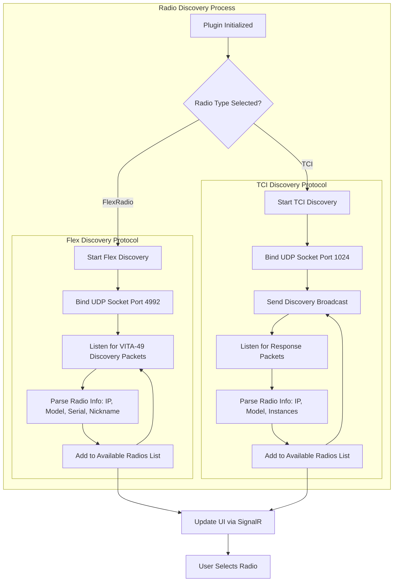
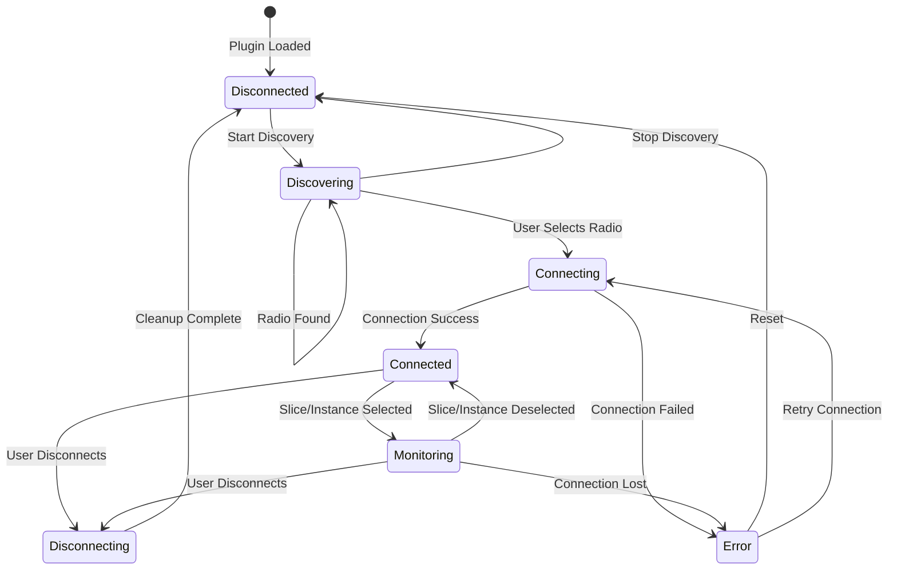
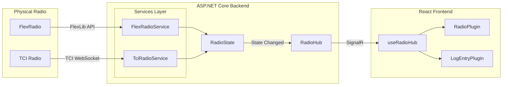
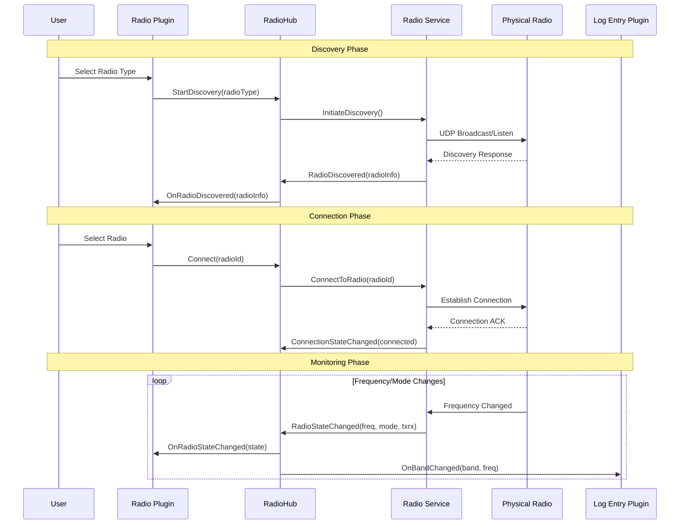

# CAT Control Support - Product Requirements Document

## Executive Summary

This document outlines the requirements for implementing Computer Aided Transceiver (CAT) control support in Log4YM. The feature enables automatic frequency and mode tracking from amateur radio transceivers, specifically supporting FlexRadio (via Flex Discovery Protocol) and TCI-compatible radios including Thetis, Hermes, and ANAN transceivers.

## Background

### Problem Statement

Ham radio operators currently need to manually enter frequency and band information when logging contacts. This creates friction in the logging workflow and increases the likelihood of logging errors, particularly during contests or high-activity periods.

### Solution Overview

By implementing CAT control support, Log4YM can automatically detect connected radios on the local network, monitor their frequency and mode in real-time, and pre-populate logging fields accordingly.

## Supported Radio Types

### FlexRadio (SmartSDR Ecosystem)

| Aspect | Details |
|--------|---------|
| Discovery Protocol | Flex Discovery Protocol (UDP broadcast) |
| Discovery Port | UDP 4992 (VITA-49 discovery) |
| Control Protocol | FlexLib API / TCP connection |
| Supported Models | FLEX-6000 series, FLEX-8000 series |

### TCI Protocol Radios

| Aspect | Details |
|--------|---------|
| Discovery Protocol | Thetis Discovery Protocol |
| Discovery Port | UDP 1024 |
| Control Protocol | TCI over WebSocket |
| Supported Radios | Thetis, Hermes Lite 2, ANAN, Red Pitaya |

## Architecture

### Discovery Flow



### Plugin State Machine



### Data Flow Architecture



### Component Interaction Sequence



## Functional Requirements

### FR-1: Radio Discovery

#### FR-1.1: FlexRadio Discovery
- The system SHALL listen on UDP port 4992 for VITA-49 discovery packets
- The system SHALL parse discovery packets to extract radio IP, model, serial number, and nickname
- The system SHALL maintain a list of discovered FlexRadio devices
- The system SHALL remove radios from the list after 30 seconds without a discovery packet

#### FR-1.2: TCI Radio Discovery
- The system SHALL send UDP broadcast packets on port 1024 for TCI discovery
- The system SHALL listen for discovery response packets containing radio information
- The system SHALL parse response packets to extract radio IP, model, and available instances
- The system SHALL periodically (every 10 seconds) re-broadcast discovery requests

### FR-2: Radio Plugin UI

#### FR-2.1: Radio Type Selection
- The plugin SHALL provide a dropdown to select radio type (FlexRadio or TCI)
- The plugin SHALL automatically start discovery when a radio type is selected

#### FR-2.2: Radio Selection
- The plugin SHALL display a list of discovered radios with Model, IP Address, and Nickname
- The user SHALL be able to select a radio from the list to initiate connection

#### FR-2.3: FlexRadio Slice Selection
- When connected to a FlexRadio, the plugin SHALL display available slices
- The user SHALL be able to select which slice to monitor for frequency changes

#### FR-2.4: TCI Instance Selection
- When connected to a TCI radio, the plugin SHALL display available receiver instances
- The user SHALL be able to select which instance to monitor

### FR-3: Status Display

#### FR-3.1: Connection Status
- The plugin SHALL display current connection state (Disconnected, Connecting, Connected, Error)
- The plugin SHALL display the connected radio model and identifier

#### FR-3.2: Radio State Display
- The plugin SHALL display current frequency in MHz
- The plugin SHALL display current operating mode (SSB, CW, FT8, AM, FM, etc.)
- The plugin SHALL display TX/RX status with visual indicator
- The plugin SHALL display the current amateur band based on frequency

### FR-4: Integration

#### FR-4.1: Band/Frequency Events
- The service SHALL publish frequency changes via SignalR to subscribed clients
- The service SHALL calculate and publish the amateur band based on frequency

#### FR-4.2: Log Entry Integration
- The Log Entry plugin SHALL subscribe to band/frequency change events
- The Log Entry plugin SHALL automatically update the band field when frequency changes

## Technical Specifications

### Backend Components

#### FlexRadioService.cs
```
Location: src/Log4YM.Server/Services/FlexRadioService.cs
Responsibilities:
- UDP listener on port 4992 for VITA-49 packets
- TCP connection to FlexRadio API
- Monitor selected slice for freq/mode changes
- Push state changes to RadioHub
```

#### TciRadioService.cs
```
Location: src/Log4YM.Server/Services/TciRadioService.cs
Responsibilities:
- UDP broadcast/listen on port 1024
- WebSocket connection for TCI protocol
- Monitor selected instance for freq/mode changes
- Push state changes to RadioHub
```

#### RadioHub.cs (SignalR)
```
Location: src/Log4YM.Server/Hubs/RadioHub.cs
```

| Method | Direction | Description |
|--------|-----------|-------------|
| StartDiscovery | Client → Server | Begin radio discovery |
| StopDiscovery | Client → Server | Stop radio discovery |
| Connect | Client → Server | Connect to selected radio |
| Disconnect | Client → Server | Disconnect from radio |
| SelectSlice | Client → Server | Select FlexRadio slice to monitor |
| SelectInstance | Client → Server | Select TCI instance to monitor |
| OnRadioDiscovered | Server → Client | Radio found during discovery |
| OnRadioRemoved | Server → Client | Radio no longer available |
| OnConnectionStateChanged | Server → Client | Connection state update |
| OnRadioStateChanged | Server → Client | Frequency/mode/TX state update |

### Frontend Components

#### RadioPlugin.tsx
```
Location: src/Log4YM.Web/src/plugins/radio/RadioPlugin.tsx
Features:
- Radio type selector
- Discovered radios list
- Connection controls
- Slice/instance selector
- Status display (frequency, mode, TX/RX)
```

#### useRadioHub.ts
```
Location: src/Log4YM.Web/src/hooks/useRadioHub.ts
Features:
- SignalR connection management
- Event subscriptions
- Method invocations
```

### Data Models

#### RadioInfo
```csharp
public class RadioInfo
{
    public string Id { get; set; }
    public RadioType Type { get; set; }      // FlexRadio or TCI
    public string Model { get; set; }        // "FLEX-6600", "Hermes Lite 2"
    public string IpAddress { get; set; }
    public string Nickname { get; set; }
    public DateTime LastSeen { get; set; }
}
```

#### RadioState
```csharp
public class RadioState
{
    public string RadioId { get; set; }
    public long FrequencyHz { get; set; }
    public string Mode { get; set; }         // "USB", "LSB", "CW", "FT8"
    public bool IsTransmitting { get; set; }
    public string Band { get; set; }         // "20m", "40m"
    public string SliceOrInstance { get; set; }
}
```

#### ConnectionState Enum
```csharp
public enum ConnectionState
{
    Disconnected,
    Discovering,
    Connecting,
    Connected,
    Monitoring,
    Error
}
```

### Frequency to Band Mapping

| Band | Lower Bound (Hz) | Upper Bound (Hz) |
|------|------------------|------------------|
| 160m | 1,800,000 | 2,000,000 |
| 80m | 3,500,000 | 4,000,000 |
| 40m | 7,000,000 | 7,300,000 |
| 30m | 10,100,000 | 10,150,000 |
| 20m | 14,000,000 | 14,350,000 |
| 17m | 18,068,000 | 18,168,000 |
| 15m | 21,000,000 | 21,450,000 |
| 12m | 24,890,000 | 24,990,000 |
| 10m | 28,000,000 | 29,700,000 |
| 6m | 50,000,000 | 54,000,000 |
| 2m | 144,000,000 | 148,000,000 |
| 70cm | 420,000,000 | 450,000,000 |

## Implementation Plan

### Phase 1: Core Infrastructure
1. Create RadioState and RadioInfo models
2. Implement RadioHub SignalR hub
3. Create base IRadioService interface
4. Implement frequency-to-band mapping utility
5. Create useRadioHub React hook

### Phase 2: FlexRadio Support
1. Implement FlexRadioDiscoveryService (UDP 4992)
2. Implement FlexRadioService for connection and state monitoring
3. Integrate with RadioHub
4. Unit tests for discovery and state parsing

### Phase 3: TCI Support
1. Implement TciDiscoveryService (UDP 1024)
2. Implement TciRadioService for WebSocket communication
3. Integrate with RadioHub
4. Unit tests for TCI protocol handling

### Phase 4: Frontend Plugin
1. Create RadioPlugin component structure
2. Implement radio type selection UI
3. Implement discovered radios list
4. Implement connection management UI
5. Implement status display (frequency, mode, TX/RX)
6. Add slice/instance selection

### Phase 5: Integration
1. Integrate with Log Entry plugin for automatic band selection
2. Add settings persistence for last-used radio
3. Implement reconnection logic
4. End-to-end testing

## Service Registration

```csharp
// Program.cs additions
builder.Services.AddSingleton<FlexRadioService>();
builder.Services.AddSingleton<TciRadioService>();
builder.Services.AddHostedService(sp => sp.GetRequiredService<FlexRadioService>());
builder.Services.AddHostedService(sp => sp.GetRequiredService<TciRadioService>());

// Hub mapping
app.MapHub<RadioHub>("/hubs/radio");
```

## Future Enhancements

1. **Additional CAT Protocols**: Hamlib, Omni-Rig, N1MM+ broadcast
2. **Multi-Radio Support**: Monitor multiple radios simultaneously (SO2R)
3. **Frequency Memories**: Quick-select stored frequencies
4. **TX Control**: PTT control via CAT for digital modes
