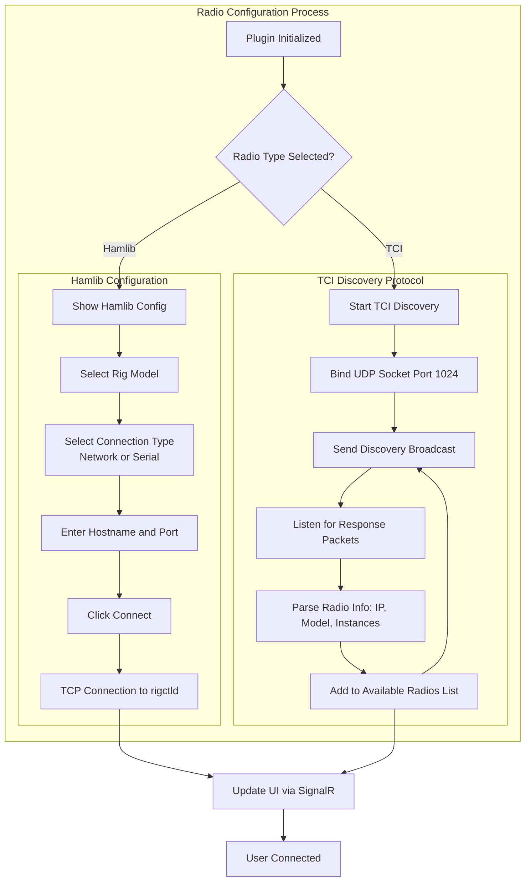
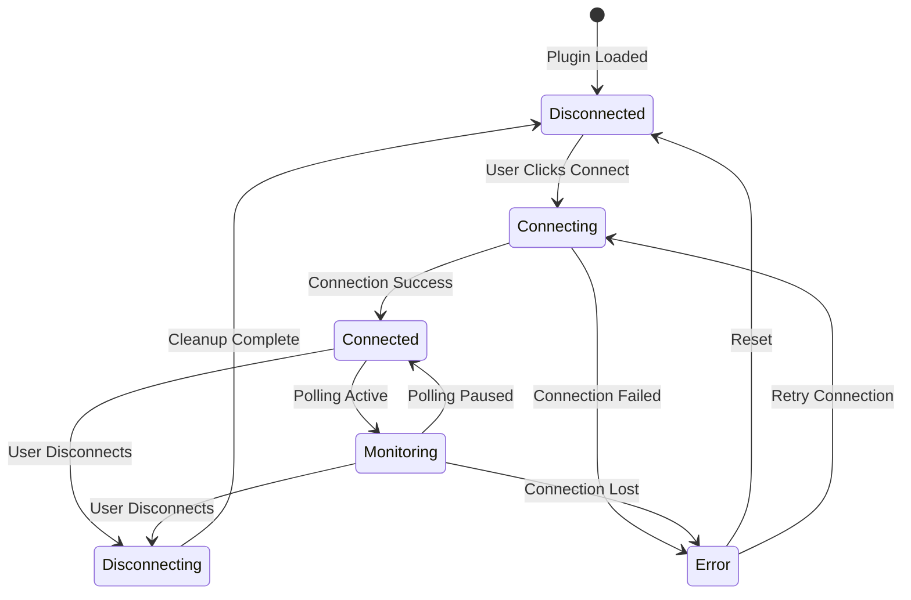
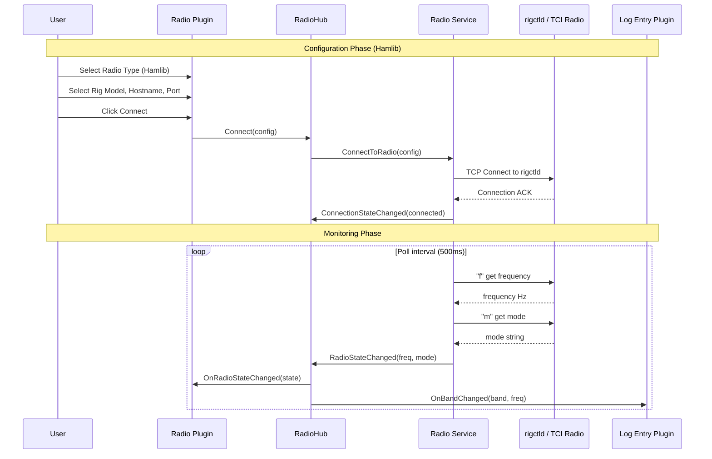

# CAT Control Support - Product Requirements Document

## Executive Summary

This document outlines the requirements for implementing Computer Aided Transceiver (CAT) control support in Log4YM. The feature enables automatic frequency and mode tracking from amateur radio transceivers, supporting **Hamlib** (covering a wide range of rigs including FlexRadio) and TCI-compatible radios including Thetis, Hermes, and ANAN transceivers.

> **FlexRadio Note:** FlexRadio devices (FLEX-6000 and FLEX-8000 series) are supported via **Hamlib**, not via the native SmartSDR/FlexLib API. Select Radio Type: Hamlib, Rig Model: FlexRadio 6xxx (Stable), Connection Type: Network.

## Background

### Problem Statement

Ham radio operators currently need to manually enter frequency and band information when logging contacts. This creates friction in the logging workflow and increases the likelihood of logging errors, particularly during contests or high-activity periods.

### Solution Overview

By implementing CAT control support, Log4YM can connect to a Hamlib `rigctld` daemon or a TCI-compatible radio, monitor frequency and mode in real-time, and pre-populate logging fields accordingly.

## Supported Radio Types

### Hamlib (All Supported Rigs)

| Aspect | Details |
|--------|---------|
| Discovery Protocol | Manual configuration (no auto-discovery) |
| Connection | TCP to `rigctld` daemon |
| Control Protocol | Hamlib rigctld protocol |
| Supported Models | 300+ rigs including FlexRadio 6xxx/8xxx, Icom, Kenwood, Yaesu, etc. |
| FlexRadio Model | Select "FlexRadio 6xxx (Stable)" in Rig Model dropdown |
| Default Port | 5002 (rigctld default) |

> **Important:** Auto-discovery is not available for Hamlib-connected radios. Users must manually configure the hostname and port of their `rigctld` instance.

### TCI Protocol Radios

| Aspect | Details |
|--------|---------|
| Discovery Protocol | Thetis Discovery Protocol |
| Discovery Port | UDP 1024 |
| Control Protocol | TCI over WebSocket |
| Supported Radios | Thetis, Hermes Lite 2, ANAN, Red Pitaya |

## Architecture

### Configuration Flow



### Plugin State Machine



### Data Flow Architecture

```mermaid
flowchart LR
    subgraph Radio["Physical Radio"]
        R1[Hamlib rigctld\n(FlexRadio, Icom, etc.)]
        R2[TCI Radio]
    end

    subgraph Backend["ASP.NET Core Backend"]
        subgraph Services["Services Layer"]
            HS[HamlibRadioService]
            TS[TciRadioService]
        end

        RS[RadioState]
        RH[RadioHub]
    end

    subgraph Frontend["React Frontend"]
        RP[RadioPlugin]
        LP[LogEntryPlugin]
        UH[useRadioHub]
    end

    R1 -->|rigctld TCP| HS
    R2 -->|TCI WebSocket| TS

    HS --> RS
    TS --> RS

    RS -->|State Changed| RH
    RH -->|SignalR| UH

    UH --> RP
    UH --> LP
```

### Component Interaction Sequence



## Functional Requirements

### FR-1: Radio Connection

#### FR-1.1: Hamlib Connection
- The system SHALL connect to a `rigctld` daemon via TCP at the configured hostname and port
- The system SHALL allow selection of rig model from Hamlib's supported rig list
- The system SHALL support Network (TCP) and Serial connection types
- The system SHALL poll the connected rigctld for frequency and mode at a configurable interval
- **Auto-discovery is not supported** for Hamlib rigs; users must configure hostname and port manually

#### FR-1.2: TCI Radio Discovery
- The system SHALL send UDP broadcast packets on port 1024 for TCI discovery
- The system SHALL listen for discovery response packets containing radio information
- The system SHALL parse response packets to extract radio IP, model, and available instances
- The system SHALL periodically (every 10 seconds) re-broadcast discovery requests

### FR-2: Radio Plugin UI

#### FR-2.1: Radio Type Selection
- The plugin SHALL provide a selector for radio type (Hamlib or TCI)
- Selecting Hamlib SHALL show the Hamlib configuration form
- Selecting TCI SHALL automatically start discovery

#### FR-2.2: Hamlib Configuration
- The plugin SHALL display: Rig Model dropdown, Connection Type selector, Hostname and Port fields
- The plugin SHALL provide a curated list of common rig models including "FlexRadio 6xxx (Stable)"
- The plugin SHALL remember last-used configuration

#### FR-2.3: TCI Instance Selection
- When connected to a TCI radio, the plugin SHALL display available receiver instances
- The user SHALL be able to select which instance to monitor

### FR-3: Status Display

#### FR-3.1: Connection Status
- The plugin SHALL display current connection state (Disconnected, Connecting, Connected, Error)
- The plugin SHALL display the connected radio model and identifier

#### FR-3.2: Radio State Display
- The plugin SHALL display current frequency in MHz
- The plugin SHALL display current operating mode (SSB, CW, FT8, AM, FM, etc.)
- The plugin SHALL display TX/RX status with visual indicator
- The plugin SHALL display the current amateur band based on frequency

### FR-4: Integration

#### FR-4.1: Band/Frequency Events
- The service SHALL publish frequency changes via SignalR to subscribed clients
- The service SHALL calculate and publish the amateur band based on frequency

#### FR-4.2: Log Entry Integration
- The Log Entry plugin SHALL subscribe to band/frequency change events
- The Log Entry plugin SHALL automatically update the band field when frequency changes

## Technical Specifications

### Backend Components

#### HamlibRadioService.cs
```
Location: src/Log4YM.Server/Services/HamlibRadioService.cs
Responsibilities:
- TCP connection to rigctld daemon
- Poll frequency and mode via rigctld protocol
- Detect state changes and push to RadioHub
```

#### TciRadioService.cs
```
Location: src/Log4YM.Server/Services/TciRadioService.cs
Responsibilities:
- UDP broadcast/listen on port 1024
- WebSocket connection for TCI protocol
- Monitor selected instance for freq/mode changes
- Push state changes to RadioHub
```

#### RadioHub.cs (SignalR)
```
Location: src/Log4YM.Server/Hubs/RadioHub.cs
```

| Method | Direction | Description |
|--------|-----------|-------------|
| Connect | Client → Server | Connect to configured radio |
| Disconnect | Client → Server | Disconnect from radio |
| SelectInstance | Client → Server | Select TCI instance to monitor |
| OnConnectionStateChanged | Server → Client | Connection state update |
| OnRadioStateChanged | Server → Client | Frequency/mode/TX state update |

### Frontend Components

#### RadioPlugin.tsx
```
Location: src/Log4YM.Web/src/plugins/radio/RadioPlugin.tsx
Features:
- Radio type selector (Hamlib / TCI)
- Hamlib: rig model, connection type, hostname, port
- TCI: discovered radios list, instance selector
- Connection controls
- Status display (frequency, mode, TX/RX)
```

#### useRadioHub.ts
```
Location: src/Log4YM.Web/src/hooks/useRadioHub.ts
Features:
- SignalR connection management
- Event subscriptions
- Method invocations
```

### Data Models

#### RadioInfo
```csharp
public class RadioInfo
{
    public string Id { get; set; }
    public RadioType Type { get; set; }      // Hamlib or TCI
    public string Model { get; set; }        // "FlexRadio 6xxx", "Hermes Lite 2"
    public string IpAddress { get; set; }
    public int Port { get; set; }
    public DateTime LastSeen { get; set; }
}
```

#### RadioState
```csharp
public class RadioState
{
    public string RadioId { get; set; }
    public long FrequencyHz { get; set; }
    public string Mode { get; set; }         // "USB", "LSB", "CW", "FT8"
    public bool IsTransmitting { get; set; }
    public string Band { get; set; }         // "20m", "40m"
}
```

#### ConnectionState Enum
```csharp
public enum ConnectionState
{
    Disconnected,
    Connecting,
    Connected,
    Monitoring,
    Error
}
```

### Frequency to Band Mapping

| Band | Lower Bound (Hz) | Upper Bound (Hz) |
|------|------------------|------------------|
| 160m | 1,800,000 | 2,000,000 |
| 80m | 3,500,000 | 4,000,000 |
| 40m | 7,000,000 | 7,300,000 |
| 30m | 10,100,000 | 10,150,000 |
| 20m | 14,000,000 | 14,350,000 |
| 17m | 18,068,000 | 18,168,000 |
| 15m | 21,000,000 | 21,450,000 |
| 12m | 24,890,000 | 24,990,000 |
| 10m | 28,000,000 | 29,700,000 |
| 6m | 50,000,000 | 54,000,000 |
| 2m | 144,000,000 | 148,000,000 |
| 70cm | 420,000,000 | 450,000,000 |

## Implementation Plan

### Phase 1: Core Infrastructure
1. Create RadioState and RadioInfo models
2. Implement RadioHub SignalR hub
3. Create base IRadioService interface
4. Implement frequency-to-band mapping utility
5. Create useRadioHub React hook

### Phase 2: Hamlib Support
1. Implement HamlibRadioService for TCP connection to rigctld
2. Implement frequency/mode polling
3. Integrate with RadioHub
4. Unit tests for rigctld response parsing

### Phase 3: TCI Support
1. Implement TciDiscoveryService (UDP 1024)
2. Implement TciRadioService for WebSocket communication
3. Integrate with RadioHub
4. Unit tests for TCI protocol handling

### Phase 4: Frontend Plugin
1. Create RadioPlugin component structure
2. Implement radio type selection UI (Hamlib / TCI)
3. Implement Hamlib configuration form
4. Implement TCI discovered radios list
5. Implement connection management UI
6. Implement status display (frequency, mode, TX/RX)

### Phase 5: Integration
1. Integrate with Log Entry plugin for automatic band selection
2. Add settings persistence for last-used radio configuration
3. Implement reconnection logic
4. End-to-end testing

## Service Registration

```csharp
// Program.cs additions
builder.Services.AddSingleton<HamlibRadioService>();
builder.Services.AddSingleton<TciRadioService>();
builder.Services.AddHostedService(sp => sp.GetRequiredService<HamlibRadioService>());
builder.Services.AddHostedService(sp => sp.GetRequiredService<TciRadioService>());

// Hub mapping
app.MapHub<RadioHub>("/hubs/radio");
```

## Future Enhancements

1. **Multi-Radio Support**: Monitor multiple radios simultaneously (SO2R)
2. **Frequency Memories**: Quick-select stored frequencies
3. **TX Control**: PTT control via CAT for digital modes
4. **N1MM+ Broadcast**: Receive frequency data from N1MM+ UDP broadcast
