# PGXL TCI Integration PRD

**Version:** 1.0
**Author:** EI6LF/b@briankeating.net
**Date:** 2025-12-21
**Status:** Draft

---

## Executive Summary

This PRD defines the requirements for integrating TCI (Thetis Control Interface) radio control with the PowerGenius XL (PGXL) amplifier via LAN. The goal is to allow a TCI-connected radio (ExpertSDR, Thetis, ANAN) to control the PGXL for band tracking and PTT coordination without requiring a physical FlexRadio.

**Key Insight:** The PGXL was designed specifically for FlexRadio integration. When paired with a FlexRadio, the PGXL acts as a **client** that connects TO the radio, not the other way around. This means we cannot simply send commands to the PGXL; we must **emulate a FlexRadio** that the PGXL connects to.

**Key Insight:** When configured with `ptt=LAN`, the PGXL keys based on the slice `tx=1` status update - no physical PTT cable required. This is 100% LAN-based control.

---

## Background

### Current State

The existing PGXL integration in Log4YM provides:
- UDP discovery of PGXL devices on port 9008
- TCP connection for status monitoring and operate/standby control
- Display of meter readings (forward power, SWR, temperature)
- Operate/Standby mode switching

### Problem Statement

The PGXL expects band and PTT data from a FlexRadio via its proprietary protocol. When a TCI radio (ExpertSDR3, Thetis, ANAN) is used instead:

1. The PGXL cannot receive band information automatically
2. The PGXL cannot coordinate PTT timing properly
3. The amp goes to STANDBY when keyed because it's waiting for data from a non-existent FlexRadio

### Why Previous Approach Failed

Our initial approach was to:
1. Monitor TCI radio for band/PTT state changes
2. Send commands to PGXL when TCI state changes

This failed because:
- The PGXL has no TCP command to "set band" or "trigger PTT"
- Band data must come from: FlexRadio LAN pairing, CAT serial, BCD input, or Pin2Band
- The PGXL connects TO the FlexRadio as a client, not the other way around
- When paired with FlexRadio serial "714", it expects that radio to send slice/PTT updates

---

## Architecture Overview

### How FlexRadio-PGXL Integration Works


> **100% LAN Control:** When `ptt=LAN` is configured, the slice `tx=1` status update keys the amplifier. No physical PTT cable required!

### Proposed Solution: FlexRadio Emulator

To integrate TCI radios with PGXL, Log4YM will emulate a FlexRadio:

```mermaid
%%{init: {'theme': 'dark', 'themeVariables': { 'primaryColor': '#3b82f6', 'primaryTextColor': '#fff', 'primaryBorderColor': '#1d4ed8', 'lineColor': '#6b7280', 'secondaryColor': '#22c55e', 'tertiaryColor': '#f97316'}}}%%
flowchart TB
    subgraph TCI["TCI Radio (ExpertSDR3 / Thetis)"]
        RADIO[("📻 SDR Radio")]
    end

    subgraph Log4YM["Log4YM Server"]
        TCISVC["TciRadioService<br/>WebSocket Client"]
        FLEXEMU["FlexRadio Emulator<br/>━━━━━━━━━━━━━━━━━━<br/>• UDP Discovery (4991)<br/>• TCP API Server (4992)<br/>• Slice Status Updates<br/>• tx=1 → PTT via LAN!"]
    end

    subgraph Amp["PGXL Amplifier"]
        PGXL[("⚡ PowerGenius XL")]
    end

    RADIO -- "WebSocket 50001<br/>TCI Protocol<br/>freq, mode, trx" --> TCISVC
    TCISVC -- "State Changes" --> FLEXEMU
    FLEXEMU -- "UDP 4991<br/>VITA-49 Discovery" --> PGXL
    PGXL -- "TCP 4992<br/>PGXL connects as client" --> FLEXEMU
    FLEXEMU -- "S|slice 0 tx=1<br/>→ PGXL KEYS!" --> PGXL

    style RADIO fill:#8b5cf6,stroke:#6d28d9,color:#fff
    style TCISVC fill:#22c55e,stroke:#16a34a,color:#fff
    style FLEXEMU fill:#3b82f6,stroke:#1d4ed8,color:#fff
    style PGXL fill:#f97316,stroke:#ea580c,color:#fff
```



> **No physical PTT cable needed** - just Ethernet + coax. The emulator sends `tx=1` and the PGXL keys via LAN!

---

## Protocol Details

### FlexRadio Discovery Protocol

The PGXL listens for VITA-49 discovery packets on **UDP port 4991**:

```c
// VITA-49 Discovery Packet Structure
typedef struct {
    uint32_t header;           // VITA-49 header
    uint32_t stream_id;        // 0x800
    uint32_t class_id_h;       // 0x534CFFFF
    uint32_t class_id_l;
    uint32_t timestamp_int;
    uint32_t timestamp_frac_h;
    uint32_t timestamp_frac_l;
    char payload[256];         // "model=FLEX-6600 serial=1234 version=3.5.0 ..."
} vita_discovery_packet;
```

**Payload Format:**
```
model=FLEX-6600 serial=1234-5678-9012-3456 version=3.5.0 name=My_Radio callsign=EI6LF ip=192.168.1.100 port=4992
```

### FlexRadio TCP API (Port 4992)

Once the PGXL discovers the emulated radio, it connects via TCP and sends:

| Command | Purpose |
|---------|---------|
| `amplifier create ip=... port=9008 model=PowerGeniusXL serial=...` | Register amplifier |
| `meter create name=FWD type=AMP min=30.0 max=63.01 units=DBM` | Create meters |
| `interlock create type=AMP valid_antennas=ANT1,ANT2 name=PG-XL serial=...` | Setup interlock |
| `keepalive enable` | Enable keepalive pings |
| `sub slice all` | Subscribe to slice updates |

### Slice Status Updates

The emulator must send slice status updates when TCI radio changes:

```
S0|slice 0 RF_frequency=14.250000 mode=USB tx=0 active=1
S0|slice 0 tx=1                                            // PTT pressed
S0|slice 0 tx=0                                            // PTT released
S0|slice 0 RF_frequency=7.150000 mode=LSB tx=0            // Band change
```

---

## PTT Considerations

### LAN PTT Mode

When configured with `ptt=LAN`, the PGXL keys based on the slice `tx=1` status update from the FlexRadio (or our emulator). This is 100% network-based with no physical PTT cable.

From FlexRadio documentation:
> "When driven by a FLEX-6000 Signature Series transceiver, the amplifier can be keyed over the radio's LAN connection."
>
> "No other physical connections are needed for the Flex-6000 and PGXL."

### PTT Timing Diagram (100% LAN)

```mermaid
%%{init: {'theme': 'dark', 'themeVariables': { 'primaryColor': '#3b82f6', 'primaryTextColor': '#fff', 'primaryBorderColor': '#1d4ed8', 'lineColor': '#6b7280', 'secondaryColor': '#22c55e', 'tertiaryColor': '#f97316'}}}%%
sequenceDiagram
    participant TCI as TCI Radio<br/>(WebSocket)
    participant L4Y as Log4YM<br/>Server
    participant EMU as FlexRadio<br/>Emulator
    participant PGXL as PGXL<br/>Amplifier

    Note over TCI: User presses PTT
    TCI->>L4Y: trx:0,true;
    L4Y->>EMU: TX state changed
    EMU->>PGXL: TCP: S|slice 0 tx=1
    Note over PGXL: ⚡ PGXL KEYS!<br/>(via LAN)

    Note over TCI: User releases PTT
    TCI->>L4Y: trx:0,false;
    L4Y->>EMU: TX state changed
    EMU->>PGXL: TCP: S|slice 0 tx=0
    Note over PGXL: PGXL unkeys
```



### Timing Concerns

Network latency could affect PTT timing. FlexRadio users report:
- TX Delay setting of 40ms recommended to prevent hot-switching
- Some CW operators report 150ms delay issues with LAN PTT

**Mitigations:**
1. Send `tx=1` as soon as TCI reports `trx:0,true;`
2. Consider sending band data preemptively when TX slice is selected
3. The PGXL has internal relay timing that provides some protection

---

## Implementation Plan

### Existing Infrastructure: SmartUnlink

**Good news!** Log4YM already has VITA-49 discovery packet broadcasting via the **SmartUnlink** feature. The `SmartUnlinkService` provides:

| Feature | Already Implemented | Location |
|---------|---------------------|----------|
| VITA-49 packet generation | ✅ Yes | `SmartUnlinkService.BuildVita49DiscoveryPacket()` |
| UDP broadcast on port 4991 | ✅ Yes | `SmartUnlinkService.BroadcastLoopAsync()` |
| UDP broadcast on port 4992 | ✅ Yes | Same method, dual-port broadcast |
| Network interface enumeration | ✅ Yes | `SmartUnlinkService.GetBroadcastAddresses()` |
| Big-endian byte handling | ✅ Yes | `SmartUnlinkService.SwapEndian()` |
| Configurable radio details | ✅ Yes | Serial, model, IP, callsign |
| MongoDB persistence | ✅ Yes | `SmartUnlinkRadioEntity` |

**What we need to add:**

| Feature | Status | Description |
|---------|--------|-------------|
| TCP API server (port 4992) | ❌ New | Accept PGXL connections |
| FLEX API command handler | ❌ New | Handle `amplifier create`, `sub slice all`, etc. |
| Slice status broadcaster | ❌ New | Send `S|slice 0 RF_frequency=... tx=...` |
| TCI-to-Emulator bridge | ❌ New | Wire TCI state changes to slice status |

The FlexEmulator can either:
1. **Extend SmartUnlink** - Add TCP server capability to existing service
2. **Create new service** - Reuse packet generation code, separate concerns

### PGXL Connection State Machine


### Phase 1: FlexRadio Emulator Service

Create a new `FlexEmulatorService` in Log4YM.Server:

```csharp
public class FlexEmulatorService : BackgroundService
{
    // Configuration
    private string _emulatedSerial = "LOG4-YM00-0000-0001";
    private string _emulatedModel = "FLEX-6600";
    private int _discoveryPort = 4991;
    private int _apiPort = 4992;

    // UDP Discovery (broadcast every 1 second)
    private async Task BroadcastDiscoveryAsync();

    // TCP API Server (accept PGXL connections)
    private async Task HandleClientAsync(TcpClient client);

    // Send slice status to connected PGXL
    public async Task SendSliceStatusAsync(double freqMHz, string mode, bool tx);
}
```

### Phase 2: TCI-to-Emulator Bridge

Connect TCI radio state to the emulator:

```csharp
// When TCI radio state changes:
tciService.OnFrequencyChanged += async (freq, mode) =>
{
    await flexEmulator.SendSliceStatusAsync(freq / 1_000_000.0, mode, false);
};

tciService.OnTxStateChanged += async (tx) =>
{
    await flexEmulator.SendSliceStatusAsync(currentFreq, currentMode, tx);
};
```

### Phase 3: PGXL Configuration

Add UI to configure the PGXL to pair with the emulated radio:

1. **Generate unique serial** for the emulator
2. **Configure PGXL** via TCP command:
   ```
   flexradio ampslice=A serial=LOG4-YM00-0000-0001 txant=ANT1 ptt=LAN active=1
   save
   ```
3. **PGXL reboots** and discovers the emulated radio

### Component Architecture

```mermaid
%%{init: {'theme': 'dark', 'themeVariables': { 'primaryColor': '#3b82f6', 'primaryTextColor': '#fff', 'primaryBorderColor': '#1d4ed8', 'lineColor': '#6b7280', 'secondaryColor': '#22c55e', 'tertiaryColor': '#f97316'}}}%%
flowchart TB
    subgraph Frontend["React Frontend"]
        PGXLUI["PgxlPlugin.tsx<br/>━━━━━━━━━━━━━━━━<br/>• Emulator enable/disable<br/>• Serial configuration<br/>• PGXL pairing button<br/>• Connection status"]
        RADIOUI["RadioPlugin.tsx<br/>━━━━━━━━━━━━━━━━<br/>• TCI connection settings<br/>• Radio status display"]
    end

    subgraph Backend["ASP.NET Core Backend"]
        HUB["LogHub.cs<br/>(SignalR)"]
        TCISVC["TciRadioService<br/>━━━━━━━━━━━━━━━━<br/>• WebSocket client<br/>• Parse TCI messages<br/>• Track freq/mode/tx"]
        FLEXEMU["FlexEmulatorService<br/>━━━━━━━━━━━━━━━━<br/>• UDP Discovery broadcast<br/>• TCP API server (4992)<br/>• Handle PGXL commands<br/>• Send slice status"]
        PGXLSVC["PgxlService<br/>━━━━━━━━━━━━━━━━<br/>• Configure pairing<br/>• Monitor PGXL status"]
    end

    subgraph External["External Devices"]
        TCI[("📻 TCI Radio<br/>ExpertSDR3")]
        PGXL[("⚡ PGXL<br/>Amplifier")]
    end

    PGXLUI <--> HUB
    RADIOUI <--> HUB
    HUB <--> TCISVC
    HUB <--> FLEXEMU
    HUB <--> PGXLSVC

    TCI -- "WebSocket 50001" --> TCISVC
    TCISVC -- "State changes" --> FLEXEMU
    FLEXEMU -- "UDP 4991 Discovery" --> PGXL
    PGXL -- "TCP 4992 (client)" --> FLEXEMU
    PGXLSVC -- "TCP 9008" --> PGXL

    style PGXLUI fill:#f97316,stroke:#ea580c,color:#fff
    style RADIOUI fill:#f97316,stroke:#ea580c,color:#fff
    style HUB fill:#22c55e,stroke:#16a34a,color:#fff
    style TCISVC fill:#22c55e,stroke:#16a34a,color:#fff
    style FLEXEMU fill:#3b82f6,stroke:#1d4ed8,color:#fff
    style PGXLSVC fill:#22c55e,stroke:#16a34a,color:#fff
    style TCI fill:#8b5cf6,stroke:#6d28d9,color:#fff
    style PGXL fill:#ef4444,stroke:#dc2626,color:#fff
```



### Implementation Tasks

| Phase | Task | Description | Priority |
|-------|------|-------------|----------|
| 1 | FLEX-EMU-1 | Create `FlexApiServerService` for TCP connections | P0 |
| 1 | FLEX-EMU-2 | ~~VITA-49 discovery~~ **Reuse SmartUnlink** | ✅ Done |
| 1 | FLEX-EMU-3 | ~~UDP broadcast~~ **Reuse SmartUnlink** | ✅ Done |
| 1 | FLEX-EMU-4 | Implement TCP server on port 4992 | P0 |
| 1 | FLEX-EMU-5 | Parse PGXL commands (`amplifier create`, `sub slice all`) | P0 |
| 1 | FLEX-EMU-6 | Send responses in FLEX API format (`R<seq>\|...`) | P0 |
| 2 | BRIDGE-1 | Wire TCI frequency changes to slice status | P0 |
| 2 | BRIDGE-2 | Wire TCI TX state (`trx:0,true;`) to `tx=1` | P0 |
| 2 | BRIDGE-3 | Send `S\|slice 0 RF_frequency=... tx=...` to PGXL | P0 |
| 3 | UI-1 | Add "Configure for TCI" button to PGXL settings | P1 |
| 3 | UI-2 | Show PGXL→Emulator connection status | P1 |
| 3 | UI-3 | Link SmartUnlink radio to TCI radio for PTT/band | P1 |

---

## Configuration

### Settings Required

| Setting | Description | Default |
|---------|-------------|---------|
| `FlexEmulator.Enabled` | Enable/disable FlexRadio emulation | `false` |
| `FlexEmulator.Serial` | Emulated serial number | `LOG4-YM00-0000-0001` |
| `FlexEmulator.Model` | Emulated model | `FLEX-6600` |
| `FlexEmulator.ApiPort` | TCP API port | `4992` |
| `FlexEmulator.DiscoveryPort` | UDP discovery port | `4991` |
| `PGXL.TciLink.SideA` | TCI radio ID linked to PGXL Side A | `null` |
| `PGXL.TciLink.SideB` | TCI radio ID linked to PGXL Side B | `null` |

---

## User Workflow

### Initial Setup

1. **Connect TCI radio** to Log4YM via WebSocket
2. **Enable FlexRadio Emulator** in Log4YM settings
3. **Configure PGXL** to pair with emulated serial:
   - Open PGXL Settings in Log4YM
   - Click "Configure as TCI Amplifier"
   - This sends the `flexradio ampslice=A serial=... txant=ANT1 ptt=LAN active=1` command
   - PGXL reboots automatically
4. **Test**:
   - Change frequency on TCI radio, verify PGXL shows correct band
   - Key TCI radio, verify PGXL keys via LAN (no PTT cable needed!)

### Normal Operation

```mermaid
%%{init: {'theme': 'dark', 'themeVariables': { 'primaryColor': '#3b82f6', 'primaryTextColor': '#fff', 'primaryBorderColor': '#1d4ed8', 'lineColor': '#6b7280', 'secondaryColor': '#22c55e', 'tertiaryColor': '#f97316'}}}%%
flowchart TD
    subgraph Phase1["1️⃣ Startup"]
        A[Log4YM starts FlexEmulator] --> B[Broadcasts VITA-49 discovery<br/>every 1 second]
    end

    subgraph Phase2["2️⃣ PGXL Discovery"]
        C[PGXL discovers emulated radio] --> D[Connects via TCP to port 4992]
        D --> E[Registers as amplifier]
        E --> F[Subscribes to slice updates]
    end

    subgraph Phase3["3️⃣ TCI Radio Connected"]
        G[TCI radio connects to Log4YM] --> H[Frequency changes pushed<br/>to FlexEmulator]
        H --> I["FlexEmulator sends<br/>S|slice 0 RF_frequency=..."]
        I --> J[PGXL switches band<br/>automatically]
    end

    subgraph Phase4["4️⃣ PTT Operation"]
        K[User presses PTT on TCI] --> L["TCI sends trx:0,true;"]
        L --> M["FlexEmulator sends<br/>S|slice 0 tx=1"]
        M --> N["⚡ PGXL keys via LAN!<br/>(no PTT cable)"]
    end

    Phase1 --> Phase2
    Phase2 --> Phase3
    Phase3 --> Phase4

    style A fill:#3b82f6,stroke:#1d4ed8,color:#fff
    style B fill:#3b82f6,stroke:#1d4ed8,color:#fff
    style C fill:#f97316,stroke:#ea580c,color:#fff
    style D fill:#f97316,stroke:#ea580c,color:#fff
    style E fill:#f97316,stroke:#ea580c,color:#fff
    style F fill:#f97316,stroke:#ea580c,color:#fff
    style G fill:#8b5cf6,stroke:#6d28d9,color:#fff
    style H fill:#8b5cf6,stroke:#6d28d9,color:#fff
    style I fill:#8b5cf6,stroke:#6d28d9,color:#fff
    style J fill:#8b5cf6,stroke:#6d28d9,color:#fff
    style K fill:#22c55e,stroke:#16a34a,color:#fff
    style L fill:#22c55e,stroke:#16a34a,color:#fff
    style M fill:#22c55e,stroke:#16a34a,color:#fff
    style N fill:#22c55e,stroke:#16a34a,color:#fff
```



---

## Alternative Approaches Considered

### Option A: BCD Band Input (Rejected)

Use BCD parallel interface for band data:
- **Pro:** Simple, no emulation needed
- **Con:** Requires additional hardware (BCD encoder)
- **Con:** Still needs hard-wired PTT
- **Con:** Defeats LAN-only goal

### Option B: CAT Serial (Rejected)

Use CAT/CIV serial for band data:
- **Pro:** Supported by many radios
- **Con:** Requires USB serial adapter
- **Con:** TCI radios don't have native CAT output
- **Con:** Still needs hard-wired PTT

### Option C: FlexRadio Emulation (Selected)

Emulate a FlexRadio on the network:
- **Pro:** 100% LAN solution - no PTT cable needed!
- **Pro:** Uses existing PGXL infrastructure (designed for this)
- **Pro:** No additional hardware (just Ethernet + coax)
- **Pro:** Band AND PTT both via LAN
- **Con:** More complex implementation
- **Con:** Potential network latency on PTT (mitigated by TX delay settings)

---

## Risks and Mitigations

| Risk | Likelihood | Impact | Mitigation |
|------|------------|--------|------------|
| PGXL firmware rejects non-Flex emulator | Medium | High | Test with actual PGXL hardware |
| Network latency affects PTT timing | Medium | Medium | Configure TX delay (40ms+), optimize code path |
| Discovery packet format changes | Low | Low | Monitor FlexRadio firmware updates |
| CW/contest operators need lower latency | Medium | Medium | Offer hard-wired PTT as fallback option |
| PGXL doesn't recognize emulated serial | Low | High | Use realistic serial format, test thoroughly |

---

## Testing Strategy

### Unit Tests
- VITA-49 packet generation
- TCP command parsing
- Slice status message formatting

### Integration Tests
- TCI state changes propagate to emulator
- PGXL connects to emulator successfully
- Band changes reflected in PGXL status

### Manual Testing Checklist

- [ ] FlexEmulator starts and broadcasts discovery
- [ ] PGXL discovers emulated radio (check PGXL utility)
- [ ] PGXL connects to emulator via TCP
- [ ] Frequency change on TCI radio updates PGXL band
- [ ] Mode change on TCI radio (if applicable)
- [ ] **LAN PTT keys amplifier** (tx=1 → PGXL keys, no cable)
- [ ] PTT latency is acceptable (<100ms for SSB)
- [ ] Network disconnect doesn't cause TX issues (failsafe)
- [ ] PGXL reconnects after network interruption
- [ ] Band changes work while transmitting (if applicable)

---

## Open Questions

1. **Q:** Does PGXL validate the FlexRadio model or just the serial?
   **A:** TBD - needs testing with actual hardware.

2. **Q:** What is the minimum acceptable PTT latency for different modes?
   **A:** SSB/digital modes are tolerant of 50-100ms. CW contesters report issues above 150ms. Need to measure actual latency in implementation.

3. **Q:** What happens if both TCI and real FlexRadio are on the network?
   **A:** The PGXL will only connect to the radio with the paired serial number.

4. **Q:** What VITA-49 fields are actually required for PGXL discovery?
   **A:** Need to test minimum viable discovery packet. May only need serial, IP, port.

5. **Q:** Does the PGXL validate the source IP of slice status messages?
   **A:** TBD - if so, emulator must bind to correct interface.

---

## References

- [PGXL API Documentation](./PGXL-Amplifier-to-Radio-API-Documentation.pdf) - FlexRadio PGXL API (in this folder)
- [SmartSDR API Wiki](https://github.com/flexradio/smartsdr-api-docs/wiki) - FlexRadio Ethernet API
- [Discovery Protocol](https://github.com/flexradio/smartsdr-api-docs/wiki/Discovery-Protocol) - VITA-49 Discovery
- [Metering Protocol](https://github.com/flexradio/smartsdr-api-docs/wiki/Metering-Protocol) - FLEX Metering
- [TCI Protocol](https://github.com/ExpertSDR3/TCI) - TCI specification
- [FlexRadio Community](https://community.flexradio.com/) - Developer discussions
