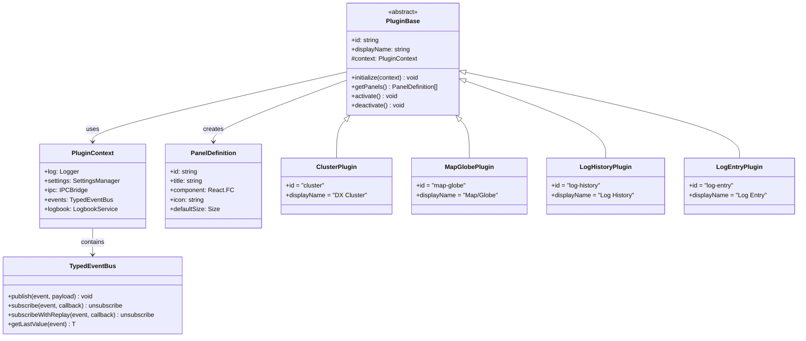

# Log4YM - Amateur Radio Logging for Young Men

> A modern, modular amateur radio logging application - because Log4OM is for Old Men

## Executive Summary

Log4YM is a next-generation amateur radio logging application built with modern web technologies. It provides a cross-platform, modular, plugin-based architecture that allows operators to customize their logging experience with drag-and-drop dockable components. The application supports real-time integrations via WebSockets, multicast UDP listeners, and native filesystem access.

## Background

### Problem Statement

Existing amateur radio logging solutions like Log4OM, while functional, are built on aging technology stacks that limit:
- Cross-platform compatibility
- Modern UI/UX expectations
- Plugin development accessibility
- Real-time collaboration capabilities

### Target Users

- Amateur radio operators (hams) seeking modern logging software
- Developers wanting to contribute plugins to an open ecosystem
- Contest operators requiring real-time cluster integration
- DXers needing QRZ lookups and ADIF management

## Objectives

### Primary Goals

1. **Cross-Platform Support**: Windows, macOS, Linux (Android as stretch goal)
2. **Modular Architecture**: Plugin-based system with hot-swappable components
3. **Modern UX**: Drag-and-drop dockable panels with customizable layouts
4. **Real-Time Integration**: WebSocket/SSE for live data, multicast UDP for cluster spots
5. **Native Capabilities**: Filesystem access for ADIF import/export, rig control

### Success Metrics

- Application runs natively on Windows, macOS, and Linux
- Minimum 4 core plugins functional at launch
- Layout persistence across sessions
- Sub-second latency for cluster spot display

## Technical Architecture

### Platform Decision: Web Application + Backend Server

**Recommendation: React SPA frontend + Node.js/Fastify backend server**

#### Rationale

The "native" capabilities (UDP multicast, serial ports, filesystem) only need to run on **one machine** - the shack PC where the radio equipment is connected. The UI can be a pure web application accessible from any device on the network (or remotely via VPN/tunnel).


#### Architecture Comparison

| Option | Pros | Cons | Verdict |
|--------|------|------|---------|
| **Web App + Server** | Access from any device, no install on clients, single update point, native mobile support | Requires server running | **Selected** |
| Electron | Self-contained | Heavy (~150MB), must install everywhere, can't use on mobile | Rejected |
| PWA + Server | Installable feel | Still needs server, PWA adds complexity | Consider for mobile |

#### Key Advantages of Web + Server Architecture

1. **Multi-Device Access**: Log from laptop, tablet, phone - all connected to same server
2. **No Client Installation**: Just open a browser - works on any OS including Android/iOS
3. **Single Source of Truth**: One database, one connection to radio equipment
4. **Easier Updates**: Update server once, all clients get new features
5. **Remote Operation**: Access your shack from anywhere (with proper security)
6. **Lower Resource Usage**: Server can be lightweight (Raspberry Pi capable)
7. **Native Hardware Access**: Server has full access to serial ports, UDP, filesystem

### High-Level Architecture


### Client-Server Communication


### Monorepo Structure

The key insight is that **plugins are full-stack modules** - each plugin has both frontend (React) and backend (.NET) components that must stay in sync.

```
log4ym/
├── Log4YM.sln                   # .NET solution file
├── package.json                 # Frontend workspace root
├── pnpm-workspace.yaml          # PNPM workspace config
├── docker-compose.yml           # Local dev / deployment
│
├── src/
│   ├── Log4YM.Server/           # ASP.NET Core Backend
│   │   ├── Program.cs
│   │   ├── Log4YM.Server.csproj
│   │   ├── appsettings.json
│   │   │
│   │   ├── Core/                # Core server infrastructure
│   │   │   ├── Events/          # Server-side event bus
│   │   │   │   ├── IEventBus.cs
│   │   │   │   ├── EventBus.cs
│   │   │   │   └── Events.cs    # Shared event types
│   │   │   ├── Database/
│   │   │   │   ├── MongoDbContext.cs
│   │   │   │   └── Repositories/
│   │   │   └── Services/        # Core services (serial, UDP base classes)
│   │   │
│   │   ├── Hubs/                # SignalR Hubs
│   │   │   └── LogHub.cs        # Main real-time hub
│   │   │
│   │   └── Plugins/             # Backend plugin modules (loaded dynamically)
│   │       ├── IPlugin.cs       # Plugin interface
│   │       ├── PluginLoader.cs
│   │       └── (plugins register their services here)
│   │
│   ├── Log4YM.Contracts/        # Shared types between client & server
│   │   ├── Log4YM.Contracts.csproj
│   │   ├── Events/              # Event DTOs (used by SignalR)
│   │   │   ├── CallsignFocusedEvent.cs
│   │   │   ├── SpotReceivedEvent.cs
│   │   │   ├── RotatorPositionEvent.cs
│   │   │   └── QsoLoggedEvent.cs
│   │   ├── Models/              # Shared domain models
│   │   │   ├── Qso.cs
│   │   │   ├── Spot.cs
│   │   │   └── Station.cs
│   │   └── Api/                 # API request/response DTOs
│   │
│   └── Log4YM.Web/              # React SPA (Frontend)
│       ├── src/
│       │   ├── App.tsx
│       │   ├── main.tsx
│       │   ├── core/            # Core frontend infrastructure
│       │   │   ├── events/      # Client-side event bus
│       │   │   ├── signalr/     # SignalR client setup
│       │   │   └── api/         # REST API client
│       │   ├── components/      # Shared UI components
│       │   ├── hooks/
│       │   └── plugins/         # Frontend plugin mounting
│       ├── index.html
│       ├── vite.config.ts
│       └── package.json
│
├── plugins/                     # FULL-STACK PLUGINS (each has frontend + backend)
│   │
│   ├── cluster/                 # DX Cluster Plugin
│   │   ├── Log4YM.Plugin.Cluster/           # Backend (.NET)
│   │   │   ├── Log4YM.Plugin.Cluster.csproj
│   │   │   ├── ClusterPlugin.cs             # IPlugin implementation
│   │   │   ├── Services/
│   │   │   │   ├── TelnetClusterService.cs  # Telnet connection
│   │   │   │   └── UdpMulticastService.cs   # UDP listener
│   │   │   ├── Hubs/
│   │   │   │   └── ClusterHub.cs            # SignalR hub for spots
│   │   │   └── Endpoints/
│   │   │       └── ClusterEndpoints.cs      # REST API
│   │   │
│   │   └── cluster-ui/                      # Frontend (React)
│   │       ├── src/
│   │       │   ├── index.ts                 # Plugin registration
│   │       │   ├── ClusterPanel.tsx
│   │       │   ├── SpotList.tsx
│   │       │   ├── hooks/
│   │       │   │   └── useClusterHub.ts     # SignalR subscription
│   │       │   └── filters/
│   │       ├── plugin.json
│   │       └── package.json
│   │
│   ├── map-globe/               # Map/Globe Plugin
│   │   ├── Log4YM.Plugin.MapGlobe/          # Backend (.NET)
│   │   │   ├── Log4YM.Plugin.MapGlobe.csproj
│   │   │   ├── MapGlobePlugin.cs
│   │   │   ├── Services/
│   │   │   │   ├── RotatorService.cs        # Serial port control
│   │   │   │   └── BearingCalculator.cs
│   │   │   ├── Hubs/
│   │   │   │   └── RotatorHub.cs
│   │   │   └── Endpoints/
│   │   │       └── RotatorEndpoints.cs
│   │   │
│   │   └── map-globe-ui/                    # Frontend (React)
│   │       ├── src/
│   │       │   ├── index.ts
│   │       │   ├── MapGlobePanel.tsx
│   │       │   ├── layers/
│   │       │   ├── controls/
│   │       │   └── hooks/
│   │       │       └── useRotatorHub.ts
│   │       ├── plugin.json
│   │       └── package.json
│   │
│   ├── log-history/             # Log History Plugin
│   │   ├── Log4YM.Plugin.LogHistory/        # Backend (.NET)
│   │   │   ├── Services/
│   │   │   │   └── AdifService.cs           # ADIF import/export
│   │   │   └── Endpoints/
│   │   │       └── QsoEndpoints.cs
│   │   │
│   │   └── log-history-ui/                  # Frontend (React)
│   │       ├── src/
│   │       │   ├── LogHistoryPanel.tsx
│   │       │   └── QsoGrid.tsx
│   │       └── package.json
│   │
│   └── log-entry/               # Log Entry Plugin
│       ├── Log4YM.Plugin.LogEntry/          # Backend (.NET)
│       │   ├── Services/
│       │   │   ├── QrzLookupService.cs
│       │   │   └── CallsignValidator.cs
│       │   └── Endpoints/
│       │       └── LookupEndpoints.cs
│       │
│       └── log-entry-ui/                    # Frontend (React)
│           ├── src/
│           │   ├── LogEntryPanel.tsx
│           │   └── QrzLookup.tsx
│           └── package.json
│
├── packages/                    # Shared frontend packages
│   ├── ui/                      # Shared UI components
│   │   ├── src/
│   │   │   ├── Button/
│   │   │   ├── Input/
│   │   │   ├── DataGrid/
│   │   │   └── theme/
│   │   └── package.json
│   │
│   └── plugin-sdk/              # Frontend plugin development kit
│       ├── src/
│       │   ├── PluginBase.ts
│       │   ├── hooks/
│       │   │   ├── useSignalR.ts
│       │   │   └── useEventBus.ts
│       │   └── components/
│       └── package.json
│
├── tools/
│   └── plugin-cli/              # Plugin scaffolding CLI (creates both frontend + backend)
│
└── docs/
    ├── prds/
    ├── architecture/
    └── plugin-development/
```

### Full-Stack Plugin Architecture

Each plugin is a **self-contained module** with both frontend and backend components. This ensures:

1. **Version Sync**: Frontend and backend are versioned together
2. **Contract Enforcement**: Shared types in `Log4YM.Contracts` ensure API compatibility
3. **Independent Development**: Teams can work on plugins in isolation
4. **Hot-Reload**: Both frontend and backend support development hot-reload


### Plugin Registration & Discovery

**Backend Plugin Interface (.NET):**

```csharp
// src/Log4YM.Server/Plugins/IPlugin.cs

public interface IPlugin
{
    string Id { get; }
    string Name { get; }
    string Version { get; }

    // Called during startup to register services
    void ConfigureServices(IServiceCollection services);

    // Called to register endpoints and hubs
    void ConfigureApp(WebApplication app);
}

// Example: plugins/cluster/Log4YM.Plugin.Cluster/ClusterPlugin.cs

public class ClusterPlugin : IPlugin
{
    public string Id => "cluster";
    public string Name => "DX Cluster";
    public string Version => "1.0.0";

    public void ConfigureServices(IServiceCollection services)
    {
        services.AddSingleton<ITelnetClusterService, TelnetClusterService>();
        services.AddSingleton<IUdpMulticastService, UdpMulticastService>();
    }

    public void ConfigureApp(WebApplication app)
    {
        app.MapHub<ClusterHub>("/hubs/cluster");
        app.MapClusterEndpoints();  // Extension method
    }
}
```

**Frontend Plugin Manifest (plugin.json):**

```json
{
  "id": "cluster",
  "name": "DX Cluster",
  "version": "1.0.0",
  "description": "Real-time DX cluster spot integration",
  "backendRequired": true,
  "panels": [
    {
      "id": "cluster-main",
      "title": "DX Cluster",
      "component": "ClusterPanel",
      "icon": "radio-tower",
      "defaultSize": { "width": 400, "height": 300 }
    }
  ],
  "signalRHubs": ["cluster"],
  "apiEndpoints": ["/api/cluster"]
}
```

**Plugin Loader (Server):**

```csharp
// src/Log4YM.Server/Plugins/PluginLoader.cs

public static class PluginLoader
{
    public static void LoadPlugins(WebApplicationBuilder builder)
    {
        var pluginDir = Path.Combine(AppContext.BaseDirectory, "plugins");

        foreach (var dll in Directory.GetFiles(pluginDir, "Log4YM.Plugin.*.dll"))
        {
            var assembly = Assembly.LoadFrom(dll);
            var pluginTypes = assembly.GetTypes()
                .Where(t => typeof(IPlugin).IsAssignableFrom(t) && !t.IsInterface);

            foreach (var pluginType in pluginTypes)
            {
                var plugin = (IPlugin)Activator.CreateInstance(pluginType)!;
                plugin.ConfigureServices(builder.Services);
                builder.Services.AddSingleton(plugin);
            }
        }
    }

    public static void ConfigurePlugins(WebApplication app)
    {
        var plugins = app.Services.GetServices<IPlugin>();
        foreach (var plugin in plugins)
        {
            plugin.ConfigureApp(app);
        }
    }
}
```

### Technology Stack

#### Frontend (React SPA)

| Component | Technology | Rationale |
|-----------|------------|-----------|
| Framework | React 18+ | Component model, hooks, massive ecosystem |
| State Management | Zustand | Lightweight, TypeScript-first |
| Server State | TanStack Query | Caching, background refetch, optimistic updates |
| Docking | FlexLayout | Best React docking library, MIT license |
| Styling | Tailwind CSS | Utility-first, dark mode support |
| Data Grid | TanStack Table | Headless, virtualized, performant |
| Forms | React Hook Form | Performant form handling |
| Build | Vite | Fast HMR, ESM native |
| WebSocket | SignalR Client | Native .NET SignalR integration |
| Maps | Leaflet + CesiumJS | 2D/3D mapping |

#### Backend (.NET 8 / ASP.NET Core)

| Component | Technology | Rationale |
|-----------|------------|-----------|
| Runtime | .NET 8 | LTS, high performance, cross-platform |
| Framework | ASP.NET Core Minimal APIs | Fast, clean routing, excellent for APIs |
| Real-time | SignalR | WebSocket abstraction with fallback, strongly typed hubs |
| UDP | System.Net.Sockets | Native UDP multicast support |
| Serial | System.IO.Ports | Built-in serial port support |
| Database | MongoDB | Document store, flexible schema, great for QSO/spot data |
| Validation | FluentValidation | Expressive validation rules |
| Logging | Serilog | Structured logging, multiple sinks |
| DI | Built-in | ASP.NET Core native DI container |
| OpenAPI | Swashbuckle | Auto-generated API docs |

#### Monorepo Tooling

| Component | Technology | Rationale |
|-----------|------------|-----------|
| Package Manager | pnpm | Fast, disk efficient |
| Build System | Turborepo | Caching, parallel builds |
| Versioning | Changesets | Monorepo versioning |
| Testing | Vitest | Vite-native, fast |
| E2E Testing | Playwright | Cross-platform Electron support |

### Plugin System Design



#### Plugin Manifest (plugin.json)

```json
{
  "name": "@log4ym/plugin-cluster",
  "displayName": "DX Cluster",
  "version": "1.0.0",
  "description": "Real-time DX cluster spot integration",
  "author": "Log4YM Team",
  "icon": "cluster-icon.svg",
  "minAppVersion": "1.0.0",
  "permissions": [
    "network:udp",
    "network:tcp"
  ],
  "panels": [
    {
      "id": "cluster-main",
      "title": "DX Cluster",
      "component": "ClusterPanel",
      "defaultSize": { "width": 400, "height": 300 },
      "icon": "cluster-panel-icon.svg"
    }
  ],
  "settings": [
    {
      "id": "clusterHost",
      "type": "string",
      "label": "Cluster Host",
      "default": "dx.example.com"
    }
  ]
}
```

#### Plugin Base Class

```typescript
// packages/plugin-sdk/src/PluginBase.ts

export interface PluginContext {
  // Core services
  log: Logger;
  settings: SettingsManager;

  // IPC to main process
  ipc: {
    invoke: <T>(channel: string, ...args: unknown[]) => Promise<T>;
    on: (channel: string, handler: (...args: unknown[]) => void) => void;
  };

  // Typed event bus for plugin-to-plugin communication
  events: TypedEventBus;

  // Access to log database
  logbook: LogbookService;
}

export abstract class PluginBase {
  abstract readonly id: string;
  abstract readonly displayName: string;

  protected context!: PluginContext;

  async initialize(context: PluginContext): Promise<void> {
    this.context = context;
  }

  abstract getPanels(): PanelDefinition[];

  async activate(): Promise<void> {}
  async deactivate(): Promise<void> {}
}
```

### Event Bus System (Inter-Plugin Communication)

A critical architectural component enabling loose coupling between plugins. Plugins publish events without knowing who consumes them, and subscribe to events without knowing who produces them.

#### Design Principles

1. **Typed Events**: All events are strongly typed with TypeScript interfaces
2. **Namespaced Topics**: Events use hierarchical naming (`plugin.domain.action`)
3. **Fire-and-Forget**: Publishers don't wait for subscribers
4. **Late Binding**: Plugins can subscribe before publishers are loaded
5. **Replay Support**: New subscribers can optionally receive last emitted value

#### Core Event Types

```typescript
// packages/core/src/events/types.ts

// ═══════════════════════════════════════════════════════════════
// CALLSIGN / QSO EVENTS
// ═══════════════════════════════════════════════════════════════

/** Emitted when user focuses on a callsign (typing, clicking spot, etc.) */
export interface CallsignFocusedEvent {
  callsign: string;
  source: string;           // Plugin ID that triggered this
  grid?: string;            // Maidenhead grid if known
  frequency?: number;       // Hz
  mode?: string;
}

/** Emitted after successful QRZ/callbook lookup */
export interface CallsignLookedUpEvent {
  callsign: string;
  name?: string;
  grid: string;
  latitude: number;
  longitude: number;
  country: string;
  dxcc: number;
  cqZone: number;
  ituZone: number;
  qslMethods?: string[];
}

/** Emitted when a QSO is logged */
export interface QSOLoggedEvent {
  id: number;
  callsign: string;
  qsoDate: string;          // YYYYMMDD
  timeOn: string;           // HHMMSS
  band: string;
  mode: string;
  frequency?: number;
  rstSent?: string;
  rstRcvd?: string;
  grid?: string;
}

// ═══════════════════════════════════════════════════════════════
// STATION / ROTATOR EVENTS
// ═══════════════════════════════════════════════════════════════

/** Current station location (configured by user) */
export interface StationLocationEvent {
  callsign: string;
  grid: string;
  latitude: number;
  longitude: number;
}

/** Current rotator position */
export interface RotatorPositionEvent {
  rotatorId: string;
  azimuth: number;          // 0-360 degrees
  isMoving: boolean;
  targetAzimuth?: number;   // If currently rotating
}

/** Request to move rotator */
export interface RotatorCommandEvent {
  rotatorId: string;
  targetAzimuth: number;
  source: string;           // Plugin requesting the move
}

// ═══════════════════════════════════════════════════════════════
// CLUSTER / SPOT EVENTS
// ═══════════════════════════════════════════════════════════════

/** New DX spot received */
export interface SpotReceivedEvent {
  dxCall: string;
  spotter: string;
  frequency: number;
  mode?: string;
  comment?: string;
  timestamp: Date;
  source: string;           // Cluster name or 'udp-multicast'
}

/** User clicked on a spot */
export interface SpotSelectedEvent {
  dxCall: string;
  frequency: number;
  mode?: string;
  grid?: string;
}

// ═══════════════════════════════════════════════════════════════
// RIG / CAT EVENTS
// ═══════════════════════════════════════════════════════════════

/** Current rig frequency/mode */
export interface RigStatusEvent {
  rigId: string;
  frequency: number;
  mode: string;
  isTransmitting: boolean;
}

/** Request to tune rig */
export interface RigTuneEvent {
  rigId: string;
  frequency: number;
  mode?: string;
  source: string;
}
```

#### Event Bus Implementation

```typescript
// packages/core/src/events/EventBus.ts

type EventMap = {
  'callsign.focused': CallsignFocusedEvent;
  'callsign.lookedUp': CallsignLookedUpEvent;
  'qso.logged': QSOLoggedEvent;
  'station.location': StationLocationEvent;
  'rotator.position': RotatorPositionEvent;
  'rotator.command': RotatorCommandEvent;
  'spot.received': SpotReceivedEvent;
  'spot.selected': SpotSelectedEvent;
  'rig.status': RigStatusEvent;
  'rig.tune': RigTuneEvent;
};

type EventCallback<T> = (payload: T) => void;

export interface TypedEventBus {
  /**
   * Publish an event to all subscribers
   */
  publish<K extends keyof EventMap>(
    event: K,
    payload: EventMap[K]
  ): void;

  /**
   * Subscribe to an event
   * @returns Unsubscribe function
   */
  subscribe<K extends keyof EventMap>(
    event: K,
    callback: EventCallback<EventMap[K]>
  ): () => void;

  /**
   * Subscribe and immediately receive last emitted value (if any)
   */
  subscribeWithReplay<K extends keyof EventMap>(
    event: K,
    callback: EventCallback<EventMap[K]>
  ): () => void;

  /**
   * Get last emitted value for an event (useful for initial state)
   */
  getLastValue<K extends keyof EventMap>(event: K): EventMap[K] | undefined;
}

class EventBusImpl implements TypedEventBus {
  private subscribers = new Map<string, Set<EventCallback<unknown>>>();
  private lastValues = new Map<string, unknown>();

  publish<K extends keyof EventMap>(event: K, payload: EventMap[K]): void {
    this.lastValues.set(event, payload);

    const callbacks = this.subscribers.get(event);
    if (callbacks) {
      callbacks.forEach(cb => {
        try {
          cb(payload);
        } catch (error) {
          console.error(`Event handler error for ${event}:`, error);
        }
      });
    }
  }

  subscribe<K extends keyof EventMap>(
    event: K,
    callback: EventCallback<EventMap[K]>
  ): () => void {
    if (!this.subscribers.has(event)) {
      this.subscribers.set(event, new Set());
    }

    const callbacks = this.subscribers.get(event)!;
    callbacks.add(callback as EventCallback<unknown>);

    return () => {
      callbacks.delete(callback as EventCallback<unknown>);
    };
  }

  subscribeWithReplay<K extends keyof EventMap>(
    event: K,
    callback: EventCallback<EventMap[K]>
  ): () => void {
    const lastValue = this.lastValues.get(event);
    if (lastValue !== undefined) {
      callback(lastValue as EventMap[K]);
    }
    return this.subscribe(event, callback);
  }

  getLastValue<K extends keyof EventMap>(event: K): EventMap[K] | undefined {
    return this.lastValues.get(event) as EventMap[K] | undefined;
  }
}

// Singleton instance
export const eventBus = new EventBusImpl();
```

#### React Hooks for Event Bus

```typescript
// packages/plugin-sdk/src/hooks/useEventBus.ts

import { useEffect, useState, useCallback } from 'react';
import { eventBus, EventMap } from '@log4ym/core';

/**
 * Subscribe to an event and re-render on new values
 */
export function useEventSubscription<K extends keyof EventMap>(
  event: K,
  options?: { replay?: boolean }
): EventMap[K] | undefined {
  const [value, setValue] = useState<EventMap[K] | undefined>(
    options?.replay ? eventBus.getLastValue(event) : undefined
  );

  useEffect(() => {
    const method = options?.replay
      ? eventBus.subscribeWithReplay
      : eventBus.subscribe;

    return method.call(eventBus, event, setValue);
  }, [event, options?.replay]);

  return value;
}

/**
 * Get a stable publish function for an event type
 */
export function useEventPublisher<K extends keyof EventMap>(event: K) {
  return useCallback(
    (payload: EventMap[K]) => eventBus.publish(event, payload),
    [event]
  );
}

/**
 * Combined hook for components that both publish and subscribe
 */
export function useEvent<K extends keyof EventMap>(
  event: K,
  options?: { replay?: boolean }
) {
  const value = useEventSubscription(event, options);
  const publish = useEventPublisher(event);
  return [value, publish] as const;
}
```

#### Event Flow Example


#### Complete Event Topology


### Docking System

Using **FlexLayout** for the docking framework:

```typescript
// packages/docking/src/DockingProvider.tsx

import { Layout, Model, TabNode, IJsonModel } from 'flexlayout-react';

interface DockingProviderProps {
  plugins: PluginDefinition[];
  savedLayout?: IJsonModel;
  onLayoutChange?: (model: IJsonModel) => void;
}

export const DockingProvider: React.FC<DockingProviderProps> = ({
  plugins,
  savedLayout,
  onLayoutChange
}) => {
  const [model, setModel] = useState<Model>(() =>
    Model.fromJson(savedLayout ?? getDefaultLayout())
  );

  const factory = useCallback((node: TabNode) => {
    const pluginId = node.getComponent();
    const plugin = plugins.find(p => p.id === pluginId);

    if (!plugin) {
      return <div>Plugin not found: {pluginId}</div>;
    }

    return <PluginRenderer plugin={plugin} nodeId={node.getId()} />;
  }, [plugins]);

  return (
    <Layout
      model={model}
      factory={factory}
      onModelChange={(m) => {
        setModel(m);
        onLayoutChange?.(m.toJson());
      }}
    />
  );
};
```

### Core Plugin Specifications

#### 1. Cluster Plugin

**Purpose**: Display real-time DX cluster spots from telnet clusters and web feeds.

**Features**:
- Connect to multiple telnet clusters simultaneously
- UDP multicast listener for local network spots
- Band/mode filtering
- Needed countries/bands highlighting
- Click-to-tune integration (via CAT)
- Spot aging with visual indicators

**Data Flow**:
```
DX Cluster (Telnet) ──┐
                      ├──► Main Process ──► IPC ──► Renderer ──► SpotList
UDP Multicast ────────┘        │
                               ▼
                          SQLite (spot cache)
```

#### 2. Map/Globe Plugin

**Purpose**: Interactive world map and 3D globe visualization with integrated rotator control, beam headings, greyline display, and QSO target visualization.

**Features**:
- **Multiple Projections**: Azimuthal (centered on station), Mercator, 3D Globe
- **Beam Heading Visualization**: Great circle path from station to target
- **Current Rotator Position**: Live display of antenna bearing with wedge overlay
- **Target Callsign Display**: Auto-updates when callsign is entered in Log Entry
- **Greyline Overlay**: Real-time day/night terminator
- **Grid Square Overlay**: Maidenhead grid reference display
- **Worked Grids**: Color-coded based on band/mode confirmations
- **Spot Plotting**: DX cluster spots as clickable markers
- **Click-to-Point**: Click anywhere on map to calculate bearing and optionally rotate

**Event Subscriptions** (receives):
- `callsign.focused` - Highlights target location, draws beam heading
- `callsign.lookedUp` - Updates with precise lat/lon from QRZ
- `spot.received` - Plots new DX spots on map
- `rotator.position` - Updates current antenna heading display
- `station.location` - Recenters azimuthal projection

**Event Publications** (emits):
- `rotator.command` - When user clicks to rotate
- `callsign.focused` - When user clicks a spot on the map

**Layer Architecture**:


**Technology Options**:

| Library | Pros | Cons | Recommendation |
|---------|------|------|----------------|
| **Leaflet + React-Leaflet** | Mature, plugins, lightweight | 2D only | Good for flat maps |
| **CesiumJS** | True 3D globe, terrain | Heavy (~30MB), complex | Best for globe mode |
| **MapLibre GL** | Vector tiles, performant | Learning curve | Good alternative |
| **deck.gl** | WebGL layers, performant | Overkill for basic needs | Future consideration |

**Recommendation**: Leaflet for 2D views + CesiumJS for 3D globe (lazy-loaded)

**Interfaces**:

```typescript
// Rotator control interface (communicates with main process)
interface RotatorController {
  connect(port: string, protocol: RotatorProtocol): Promise<void>;
  getCurrentAzimuth(): Promise<number>;
  setAzimuth(degrees: number): Promise<void>;
  stop(): Promise<void>;
  disconnect(): Promise<void>;
}

// Map layer interface for composability
interface MapLayer {
  id: string;
  name: string;
  visible: boolean;
  zIndex: number;
  render(context: MapContext): React.ReactNode;
  onToggle?(visible: boolean): void;
}

// Bearing calculation utilities
interface BearingUtils {
  calculateBearing(from: LatLon, to: LatLon): { shortPath: number; longPath: number };
  calculateDistance(from: LatLon, to: LatLon): { km: number; miles: number };
  greatCirclePath(from: LatLon, to: LatLon, points?: number): LatLon[];
  gridToLatLon(grid: string): LatLon;
  latLonToGrid(lat: number, lon: number, precision?: number): string;
}
```

**Example Component Usage**:

```typescript
// plugins/map-globe/src/MapGlobePanel.tsx

export const MapGlobePanel: React.FC = () => {
  // Subscribe to callsign focus events
  const focusedCallsign = useEventSubscription('callsign.focused', { replay: true });
  const lookedUpData = useEventSubscription('callsign.lookedUp', { replay: true });
  const rotatorPosition = useEventSubscription('rotator.position', { replay: true });
  const stationLocation = useEventSubscription('station.location', { replay: true });

  // Publisher for rotator commands
  const publishRotatorCommand = useEventPublisher('rotator.command');

  const handleMapClick = useCallback((lat: number, lon: number) => {
    if (!stationLocation) return;

    const bearing = calculateBearing(
      { lat: stationLocation.latitude, lon: stationLocation.longitude },
      { lat, lon }
    );

    publishRotatorCommand({
      rotatorId: 'default',
      targetAzimuth: bearing.shortPath,
      source: 'map-globe'
    });
  }, [stationLocation, publishRotatorCommand]);

  return (
    <MapContainer>
      <BaseMapLayer />
      <GreylineLayer />
      <GridSquareLayer />
      {lookedUpData && (
        <BeamPathLayer
          from={stationLocation}
          to={{ lat: lookedUpData.latitude, lon: lookedUpData.longitude }}
        />
      )}
      {rotatorPosition && (
        <RotatorWedgeLayer
          center={stationLocation}
          azimuth={rotatorPosition.azimuth}
          beamwidth={45}
        />
      )}
      <MapClickHandler onClick={handleMapClick} />
    </MapContainer>
  );
};
```

#### 3. Log History Plugin

**Purpose**: Display and manage QSO history with ADIF import/export.

**Features**:
- Virtualized grid for 100k+ QSOs
- Column customization
- Advanced filtering and search
- ADIF import/export
- QSL status tracking
- Statistics and charts

**ADIF Support**:
- Full ADIF 3.1.4 specification compliance
- Custom field mapping
- Duplicate detection on import
- Export templates for LoTW, eQSL, Club Log

#### 4. Log Entry Plugin

**Purpose**: Primary QSO entry interface with real-time lookups.

**Features**:
- Callsign input with auto-completion
- QRZ.com XML API integration
- Real-time DXCC/state lookup
- Previous QSO notification
- Band/mode from CAT
- RST exchange
- Contest mode support

**QRZ Integration**:
```typescript
interface QRZLookupResult {
  callsign: string;
  name: string;
  address: string;
  grid: string;
  country: string;
  dxcc: number;
  cqZone: number;
  ituZone: number;
  image?: string;
  bio?: string;
}

class QRZService {
  async login(username: string, password: string): Promise<string>;
  async lookup(callsign: string, sessionKey: string): Promise<QRZLookupResult>;
}
```

### WebAPI Server

Embedded Fastify server in main process for external integrations:

```typescript
// apps/desktop/src/main/webapi/server.ts

import Fastify from 'fastify';

const server = Fastify({ logger: true });

// QSO endpoints
server.get('/api/qsos', async (request, reply) => {
  // Return recent QSOs
});

server.post('/api/qsos', async (request, reply) => {
  // Log new QSO
});

// Cluster endpoints
server.get('/api/spots', async (request, reply) => {
  // Return current spots
});

// WebSocket for real-time updates
server.register(require('@fastify/websocket'));

server.get('/ws', { websocket: true }, (connection, req) => {
  // Real-time spot/QSO streaming
});
```

### Data Storage

#### MongoDB Collections

MongoDB is ideal for Log4YM because:
- **Flexible schema**: ADIF has 100+ optional fields - documents handle this naturally
- **Embedded documents**: QSL status, contest info can be nested
- **TTL indexes**: Auto-expire old cluster spots
- **Text search**: Full-text search on comments, notes
- **Aggregation**: Statistics, band/mode breakdowns

**Database: `log4ym`**

```javascript
// Collection: qsos
{
  _id: ObjectId("..."),
  callsign: "W1AW",
  qsoDate: ISODate("2024-01-15T14:30:00Z"),
  timeOn: "143000",
  timeOff: "143500",
  band: "20m",
  mode: "SSB",
  frequency: 14.250,
  rstSent: "59",
  rstRcvd: "57",

  // Station info (embedded document)
  station: {
    name: "John Smith",
    qth: "Newington, CT",
    grid: "FN31pr",
    country: "United States",
    dxcc: 291,
    cqZone: 5,
    ituZone: 8,
    state: "CT",
    county: "Hartford"
  },

  // QSL status (embedded document)
  qsl: {
    sent: "Y",
    sentDate: ISODate("2024-01-16"),
    rcvd: "N",
    rcvdDate: null,
    lotw: { sent: "Y", rcvd: "N" },
    eqsl: { sent: "N", rcvd: "N" },
    clublog: { sent: "Y" }
  },

  // Contest info (optional embedded document)
  contest: {
    id: "CQWW-SSB",
    serialSent: "001",
    serialRcvd: "123",
    exchange: "5NN CT"
  },

  // Extensible - any ADIF field can be added
  comment: "Good signal, first QSO with CT",
  notes: "Met at Dayton 2023",

  // Metadata
  createdAt: ISODate("2024-01-15T14:35:00Z"),
  updatedAt: ISODate("2024-01-16T10:00:00Z"),
  createdBy: "log-entry-plugin"
}

// Collection: spots (with TTL index for auto-expiry)
{
  _id: ObjectId("..."),
  dxCall: "VK9XY",
  spotter: "W1AW",
  frequency: 14.025,
  mode: "CW",
  comment: "UP 2",
  source: "dx.example.com",       // Cluster source
  timestamp: ISODate("2024-01-15T14:30:00Z"),
  createdAt: ISODate("2024-01-15T14:30:00Z"),  // TTL index on this field

  // Enriched data (added by lookup)
  dxStation: {
    country: "Christmas Island",
    dxcc: 35,
    grid: "OH29",
    continent: "OC"
  }
}

// Collection: settings
{
  _id: "station",
  callsign: "EI6LF",
  grid: "IO63",
  latitude: 53.3498,
  longitude: -6.2603,
  qrzUsername: "ei6lf",
  // Encrypted or reference to secrets manager
  qrzApiKey: "encrypted:..."
}

// Collection: pluginSettings
{
  _id: "cluster",
  connections: [
    { host: "dx.example.com", port: 7300, enabled: true },
    { host: "skimmer.example.com", port: 7373, enabled: true }
  ],
  filters: {
    bands: ["20m", "40m", "15m"],
    modes: ["CW", "SSB"],
    minFreq: 14000,
    maxFreq: 14350
  }
}

// Collection: layouts
{
  _id: "default",
  name: "Default Layout",
  isDefault: true,
  layout: {
    // FlexLayout JSON model
    global: { ... },
    borders: [ ... ],
    layout: { ... }
  },
  createdAt: ISODate("2024-01-01"),
  updatedAt: ISODate("2024-01-15")
}
```

**Indexes:**

```javascript
// qsos collection
db.qsos.createIndex({ callsign: 1 })
db.qsos.createIndex({ qsoDate: -1 })
db.qsos.createIndex({ band: 1, mode: 1 })
db.qsos.createIndex({ "station.dxcc": 1 })
db.qsos.createIndex({ "station.grid": 1 })
db.qsos.createIndex({ "$**": "text" })  // Full-text search

// spots collection (TTL: auto-delete after 24 hours)
db.spots.createIndex({ createdAt: 1 }, { expireAfterSeconds: 86400 })
db.spots.createIndex({ frequency: 1 })
db.spots.createIndex({ dxCall: 1 })
db.spots.createIndex({ timestamp: -1 })
```

**C# MongoDB Models:**

```csharp
// src/Log4YM.Contracts/Models/Qso.cs

public class Qso
{
    [BsonId]
    [BsonRepresentation(BsonType.ObjectId)]
    public string Id { get; set; } = null!;

    [BsonElement("callsign")]
    public string Callsign { get; set; } = null!;

    [BsonElement("qsoDate")]
    public DateTime QsoDate { get; set; }

    [BsonElement("band")]
    public string Band { get; set; } = null!;

    [BsonElement("mode")]
    public string Mode { get; set; } = null!;

    [BsonElement("frequency")]
    public double? Frequency { get; set; }

    [BsonElement("rstSent")]
    public string? RstSent { get; set; }

    [BsonElement("rstRcvd")]
    public string? RstRcvd { get; set; }

    [BsonElement("station")]
    public StationInfo? Station { get; set; }

    [BsonElement("qsl")]
    public QslStatus? Qsl { get; set; }

    [BsonElement("contest")]
    public ContestInfo? Contest { get; set; }

    [BsonExtraElements]
    public BsonDocument? AdifExtra { get; set; }  // Catches any extra ADIF fields

    [BsonElement("createdAt")]
    public DateTime CreatedAt { get; set; } = DateTime.UtcNow;

    [BsonElement("updatedAt")]
    public DateTime UpdatedAt { get; set; } = DateTime.UtcNow;
}

public class StationInfo
{
    public string? Name { get; set; }
    public string? Qth { get; set; }
    public string? Grid { get; set; }
    public string? Country { get; set; }
    public int? Dxcc { get; set; }
    public int? CqZone { get; set; }
    public int? ItuZone { get; set; }
}
```

**Repository Pattern:**

```csharp
// src/Log4YM.Server/Core/Database/Repositories/QsoRepository.cs

public interface IQsoRepository
{
    Task<Qso> GetByIdAsync(string id);
    Task<IEnumerable<Qso>> GetRecentAsync(int limit = 100);
    Task<IEnumerable<Qso>> SearchAsync(QsoSearchCriteria criteria);
    Task<Qso> CreateAsync(Qso qso);
    Task UpdateAsync(Qso qso);
    Task DeleteAsync(string id);
    Task<QsoStatistics> GetStatisticsAsync();
}

public class QsoRepository : IQsoRepository
{
    private readonly IMongoCollection<Qso> _collection;

    public QsoRepository(IMongoDatabase database)
    {
        _collection = database.GetCollection<Qso>("qsos");
    }

    public async Task<IEnumerable<Qso>> GetRecentAsync(int limit = 100)
    {
        return await _collection
            .Find(_ => true)
            .SortByDescending(q => q.QsoDate)
            .Limit(limit)
            .ToListAsync();
    }

    // ... other methods
}
```

### Security Considerations

1. **Authentication**: Optional JWT-based auth for remote access
2. **CORS**: Configurable allowed origins
3. **CSP Headers**: Strict content security policy
4. **Input Validation**: All user inputs validated with Zod schemas
5. **API Keys**: Stored encrypted in MongoDB or environment variables
6. **Network Binding**: Default to localhost only, explicit config for LAN/remote
7. **HTTPS**: Optional TLS termination for remote access

### Mobile & Remote Access

With the web-based architecture, mobile support comes **free**:


**Key Benefits:**
- **Android/iOS**: Works in any mobile browser - no app store needed
- **No Installation**: Just bookmark the URL
- **Responsive Design**: Tailwind CSS ensures mobile-friendly layouts
- **PWA Option**: Can be "installed" as a home screen app for app-like experience
- **Offline Support**: Service worker can cache UI for offline viewing (read-only)

**Remote Access Options:**
1. **Tailscale/ZeroTier**: Easiest - creates secure mesh VPN
2. **WireGuard VPN**: Self-hosted secure tunnel
3. **Cloudflare Tunnel**: Expose without port forwarding
4. **SSH Tunnel**: `ssh -L 3000:localhost:3000 shack-pc`

## Implementation Plan


### Phase 1: Foundation

- [ ] Initialize solution (.NET 8 + pnpm workspace)
- [ ] Create ASP.NET Core server with MongoDB
- [ ] Create React SPA with Vite
- [ ] Implement SignalR real-time communication
- [ ] Implement FlexLayout docking system
- [ ] Create plugin SDK (IPlugin interface + React hooks)
- [ ] Implement typed Event Bus (server + client sync)
- [ ] Set up Log4YM.Contracts for shared types

### Phase 2: Core Plugins

- [ ] Log Entry plugin with basic QSO entry
- [ ] Log History plugin with ADIF import/export
- [ ] QRZ lookup integration
- [ ] Settings management system

### Phase 3: Real-Time Features

- [ ] Cluster plugin with telnet client
- [ ] UDP multicast listener
- [ ] Map/Globe plugin with Leaflet/CesiumJS
- [ ] Rotator serial communication integration
- [ ] WebSocket server for external apps

### Phase 4: Polish & Distribution

- [ ] Docker image for easy deployment
- [ ] Raspberry Pi ARM image
- [ ] Documentation site
- [ ] Plugin marketplace concept

### Deployment Options


**Example docker-compose.yml:**

```yaml
version: '3.8'
services:
  log4ym:
    image: log4ym/server:latest
    build:
      context: .
      dockerfile: src/Log4YM.Server/Dockerfile
    ports:
      - "5000:5000"              # HTTP
      - "5001:5001"              # HTTPS (optional)
    volumes:
      - ./config:/app/config      # Configuration files
    devices:
      - /dev/ttyUSB0:/dev/ttyUSB0 # Rotator serial port
      - /dev/ttyUSB1:/dev/ttyUSB1 # Radio CAT port
    environment:
      - ASPNETCORE_URLS=http://+:5000
      - ASPNETCORE_ENVIRONMENT=Production
      - MongoDB__ConnectionString=mongodb://mongodb:27017
      - MongoDB__DatabaseName=log4ym
      - Qrz__Username=${QRZ_USER}
      - Qrz__Password=${QRZ_PASS}
    depends_on:
      - mongodb
    restart: unless-stopped

  mongodb:
    image: mongo:7
    ports:
      - "27017:27017"
    volumes:
      - mongodb_data:/data/db
      - ./mongo-init:/docker-entrypoint-initdb.d  # Init scripts
    environment:
      - MONGO_INITDB_DATABASE=log4ym
    restart: unless-stopped

  # Optional: MongoDB admin UI
  mongo-express:
    image: mongo-express:latest
    ports:
      - "8081:8081"
    environment:
      - ME_CONFIG_MONGODB_SERVER=mongodb
      - ME_CONFIG_BASICAUTH_USERNAME=admin
      - ME_CONFIG_BASICAUTH_PASSWORD=${MONGO_EXPRESS_PASS:-admin}
    depends_on:
      - mongodb
    profiles:
      - dev  # Only start with: docker-compose --profile dev up

volumes:
  mongodb_data:
```

**Example Dockerfile (.NET):**

```dockerfile
# src/Log4YM.Server/Dockerfile

FROM mcr.microsoft.com/dotnet/aspnet:8.0 AS base
WORKDIR /app
EXPOSE 5000

FROM mcr.microsoft.com/dotnet/sdk:8.0 AS build
WORKDIR /src

# Copy solution and restore
COPY Log4YM.sln .
COPY src/Log4YM.Server/*.csproj src/Log4YM.Server/
COPY src/Log4YM.Contracts/*.csproj src/Log4YM.Contracts/
COPY plugins/*/Log4YM.Plugin.*/*.csproj ./plugins/
RUN dotnet restore

# Build
COPY . .
RUN dotnet build -c Release -o /app/build

FROM build AS publish
RUN dotnet publish src/Log4YM.Server -c Release -o /app/publish

# Final image
FROM base AS final
WORKDIR /app
COPY --from=publish /app/publish .

# Copy frontend build (from separate Node build step)
COPY --from=node-build /app/dist ./wwwroot

ENTRYPOINT ["dotnet", "Log4YM.Server.dll"]
```

## Risks and Mitigations

| Risk | Impact | Mitigation |
|------|--------|------------|
| Serial port access in Docker | Hardware control | Use `--device` flag, document permissions |
| WebSocket disconnects | User experience | Auto-reconnect with backoff, offline queue |
| Serial port compatibility | Feature completeness | Extensive testing matrix, fallback protocols |
| QRZ API rate limits | User experience | Local caching, batch lookups |
| Multi-client conflicts | Data integrity | Optimistic locking, real-time sync via WebSocket |

## Open Questions

1. Should we support multiple logbooks or single logbook per installation?
2. Contest logging: separate plugin or integrated mode?
3. Cloud sync: build custom or integrate with existing (Club Log, etc.)?
4. Licensing model: MIT, GPL, or proprietary?

## Appendix

### Reference Applications

- **Log4OM**: Feature-rich Windows logging (inspiration for features)
- **WSJT-X**: Modern amateur radio app architecture reference
- **JS8Call**: Good example of native + cross-platform approach
- **CloudLog**: Web-based logging (API design reference)

### Amateur Radio Data Standards

- **ADIF**: Amateur Data Interchange Format 3.1.4
- **Cabrillo**: Contest log format
- **WSJT-X UDP Protocol**: Multicast spot format

### Useful Resources

- [ADIF Specification](https://adif.org/)
- [QRZ XML API](https://www.qrz.com/page/xml_data.html)
- [DX Cluster Protocol](http://www.dxcluster.info/)
- [Yaesu CAT Protocol](https://www.yaesu.com/indexVS.cfm?cmd=DisplayProducts&ProdCatID=102)
