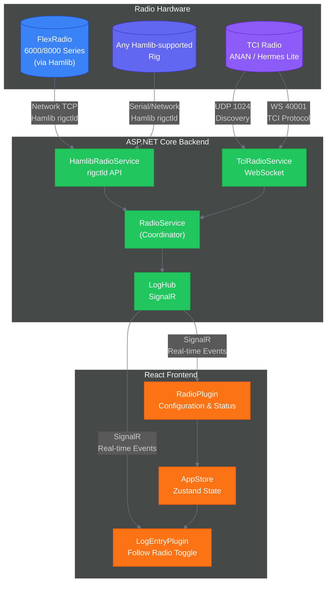
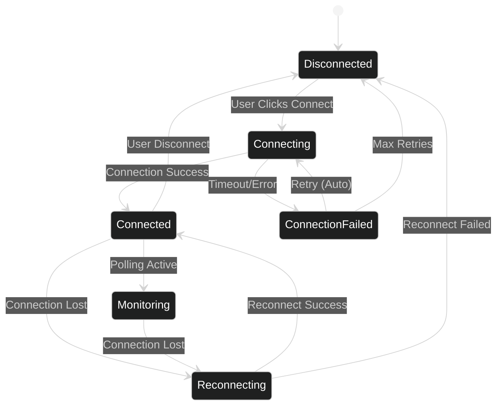
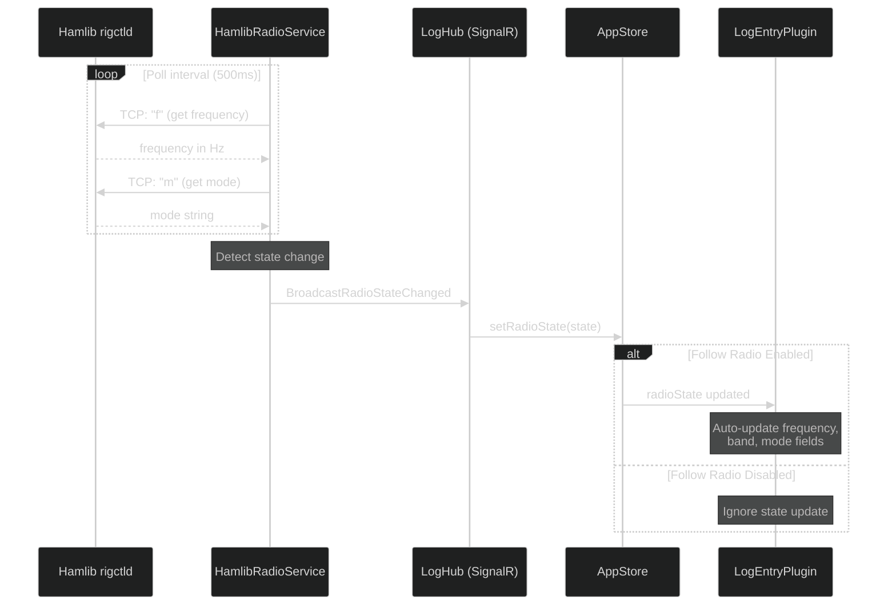
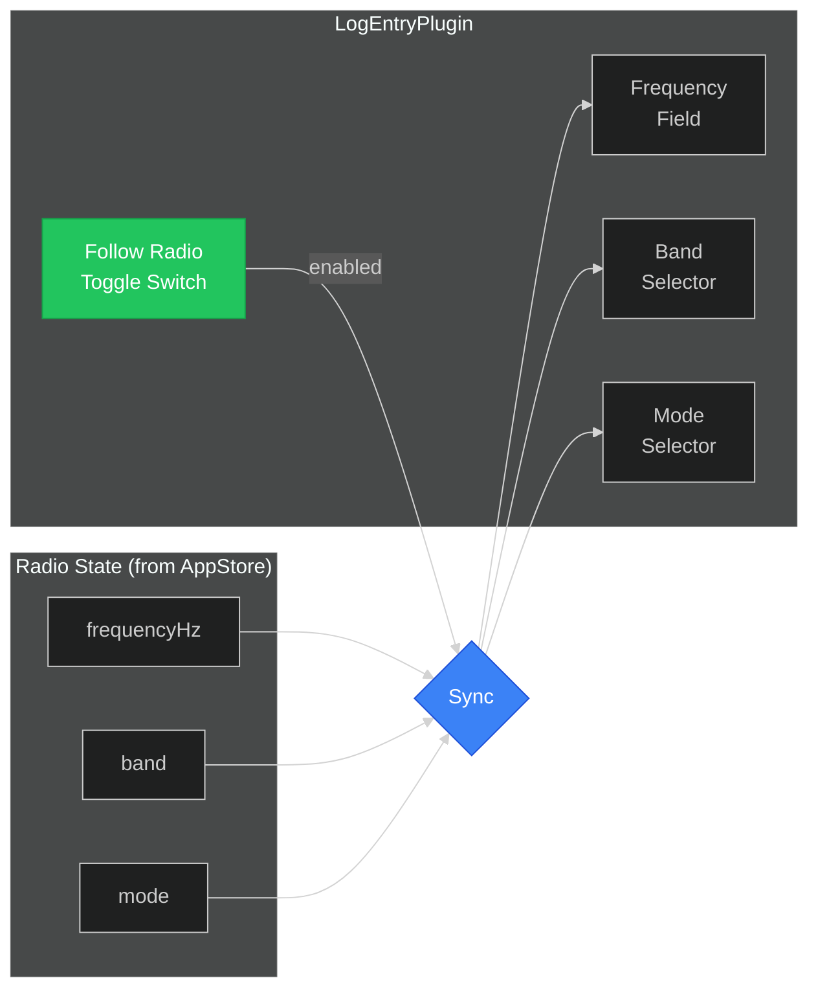

# Radio Integration PRD

**Version:** 1.1
**Author:** Log4YM Development Team
**Date:** 2025-12-16
**Status:** Draft

---

## Executive Summary

This PRD defines the requirements for integrating amateur radio transceiver control into Log4YM. The Radio Plugin enables automatic frequency, mode, and band tracking from connected radios, eliminating manual data entry during logging.

**Phase 1** focuses on Hamlib-based radio integration, supporting a wide range of radios including FlexRadio (via Hamlib's FlexRadio 6xxx driver).
**Phase 2** adds TCI protocol support for ANAN, Thetis, and Hermes Lite radios.

> **Note:** FlexRadio devices are supported via **Hamlib**, not via the native SmartSDR TCP API. Users should select Radio Type: **Hamlib** and Rig Model: **FlexRadio 6xxx (Stable)** with a Network connection to their radio.

The integration provides real-time radio state synchronization to the LogEntryPlugin through a "Follow Radio" toggle, automatically populating QSO frequency, band, and mode fields.

---

## Background

### Current State

Log4YM currently supports:
- Manual frequency/band/mode entry in LogEntryPlugin
- HamlibRadioService with configurable rig model and network/serial connection
- TciRadioService with UDP discovery (port 1024) and WebSocket connection
- RadioPlugin UI with Hamlib/TCI radio type selection and inline configuration

### Problem Statement

Amateur radio operators frequently switch frequencies and modes during operating sessions. Manual entry of this data into logging software is:
1. Time-consuming and interrupts operating flow
2. Error-prone, especially during contests or pileups
3. Inconsistent when operators forget to update fields

### Solution Overview

Automatic radio tracking eliminates these issues by:
- Connecting to radios via Hamlib (wide rig support) or TCI protocol
- Maintaining persistent connections with real-time state updates
- Pushing frequency/mode changes to the logging interface
- Providing a user-controlled toggle to enable/disable auto-population

---

## Architecture Overview



---

## Radio Type Comparison

| Feature | Hamlib (incl. FlexRadio) | TCI Radio (Phase 2) |
|---------|--------------------------|---------------------|
| **Target Radios** | 300+ rigs incl. FlexRadio 6xxx/8xxx | ANAN, Thetis, Hermes Lite |
| **Discovery** | Manual configuration (hostname + port) | UDP 1024 |
| **Connection** | TCP to rigctld daemon | WebSocket |
| **FlexRadio Port** | 5002 (rigctld default) | N/A |
| **Frequency Format** | Hz (rigctld standard) | `vfo:0,14250000;` (Hz) |
| **Mode Format** | `USB`, `CW`, etc. | `modulation:0,USB;` |
| **Multi-receiver** | Single VFO per rigctld instance | Receivers (0-n) |
| **FlexRadio Note** | Select Rig Model: "FlexRadio 6xxx (Stable)" | N/A |

---

## Objectives

### Primary Goals

| ID | Objective | Success Metric |
|----|-----------|----------------|
| O1 | Hamlib radio frequency/mode tracking | Frequency updates within 100ms of radio change |
| O2 | Automatic log field population | 95% reduction in manual frequency entry |
| O3 | Simple configuration experience | Connect with hostname + port after initial setup |
| O4 | Reliable connection management | Auto-reconnect within 5 seconds of disconnect |

### Non-Goals (Phase 1)

- TX/PTT control from Log4YM
- Multi-radio simultaneous connections
- Direct rig control (frequency changes from software)
- Native FlexRadio SmartSDR TCP API integration (use Hamlib instead)

---

## User Stories

### US-1: Radio Configuration
**As a** Hamlib radio operator
**I want to** configure my radio's hostname and port
**So that** I can connect without network discovery

**Acceptance Criteria:**
- RadioPlugin displays Hamlib configuration fields (Rig Model, Connection Type, Hostname, Port)
- User can select Rig Model from dropdown (e.g., "FlexRadio 6xxx (Stable)")
- Settings are persisted across sessions

### US-2: Radio Connection
**As a** radio operator
**I want to** connect to my configured radio
**So that** Log4YM can track my frequency and mode

**Acceptance Criteria:**
- Single click connects to configured radio
- Connection status displayed (Disconnected/Connecting/Connected/Monitoring)
- Error messages shown for connection failures

### US-3: Follow Radio Toggle
**As a** logger
**I want to** toggle automatic frequency tracking
**So that** I can control when the log entry updates

**Acceptance Criteria:**
- Toggle visible in LogEntryPlugin header
- When enabled, frequency/band/mode auto-update from radio
- When disabled, fields remain editable but static
- Toggle state persists across sessions

### US-4: FlexRadio via Hamlib
**As a** FlexRadio operator
**I want** to connect my FlexRadio via Hamlib
**So that** I can use Log4YM without needing SmartSDR API access

**Acceptance Criteria:**
- Select Radio Type: Hamlib
- Select Rig Model: FlexRadio 6xxx (Stable)
- Set Connection Type: Network, Hostname: localhost (or radio IP), Port: 5002
- Frequency and mode updates are reflected in Log4YM

---

## Technical Design

### Hamlib rigctld Connection

Hamlib requires a running `rigctld` daemon that Log4YM connects to via TCP:

```
Connection:
+-- Connect to rigctld hostname:port (default port 5002)
+-- Poll: "f" command → returns current frequency in Hz
+-- Poll: "m" command → returns current mode and passband
+-- Interval: configurable (default 500ms)
```

For FlexRadio, start rigctld with:
```bash
rigctld -m 2069 -t 5002  # FlexRadio 6xxx (Stable) rig model
```

### Radio Connection State Machine



### Data Flow: Radio to Log Entry



### LogEntryPlugin Integration



---

## FlexRadio Configuration

FlexRadio devices are connected via Hamlib rather than the native SmartSDR API. This approach is simpler and does not require SmartSDR to be running.

| Setting | Value |
|---------|-------|
| **Radio Type** | Hamlib |
| **Rig Model** | FlexRadio 6xxx (Stable) |
| **Connection Type** | Network |
| **Hostname** | `localhost` (or radio IP) |
| **Port** | `5002` |

> **Note:** For multi-slice FlexRadio setups, rigctld exposes a single VFO. Advanced slice management is not available via Hamlib.

---

## Configuration

### Inline Configuration (RadioPlugin)

The radio connection is configured inline within the RadioPlugin:

1. **Select Radio Type** - Hamlib or TCI (different protocols)
2. **Select Rig Model** - Choose rig from Hamlib's supported list (e.g., "FlexRadio 6xxx (Stable)")
3. **Connection Type** - Network (TCP to rigctld) or Serial
4. **Hostname/Port** - Address of the rigctld daemon
5. **Connect** - Establish connection

### Persistent Settings

```typescript
interface RadioSettings {
  lastRadioType: 'Hamlib' | 'Tci';
  lastRigModel: string;
  lastConnectionType: 'Network' | 'Serial';
  lastHostname: string;
  lastPort: number;
  autoConnect: boolean;
  followRadioEnabled: boolean;
}
```

---

## Implementation Plan

### Phase 1: Hamlib Integration

| Task | Description | Priority |
|------|-------------|----------|
| HAM-1 | Implement HamlibRadioService TCP connection to rigctld | P0 |
| HAM-2 | Poll frequency and mode from rigctld | P0 |
| HAM-3 | Implement rig model selection UI | P0 |
| LEP-1 | Add Follow Radio toggle to LogEntryPlugin header | P0 |
| LEP-2 | Subscribe to radioState and auto-populate fields | P0 |
| LEP-3 | Persist followRadio setting | P1 |
| TEST-1 | Test with real hardware via Hamlib | P0 |

### Phase 2: TCI Protocol Support (Future)

| Task | Description | Priority |
|------|-------------|----------|
| TCI-1 | Update TciRadioService WebSocket to use port 40001 | High |
| TCI-2 | Implement TCI command parsing | High |
| TCI-3 | Update RadioPlugin for TCI-specific config | Medium |
| TCI-4 | Test with Thetis, ANAN, Hermes Lite | High |

---

## Error Handling

| Error Condition | Recovery Action |
|-----------------|-----------------|
| Connection refused | Display error, check hostname/port configuration |
| rigctld not running | Show error message with instructions to start rigctld |
| Connection lost | Auto-reconnect with exponential backoff |
| Parse error | Log warning, continue with last known state |
| Invalid frequency | Ignore update, maintain previous value |

---

## Testing Strategy

### Unit Tests
- HamlibRadioService response parsing
- Frequency-to-band conversion
- State machine transitions

### Integration Tests
- End-to-end connection flow
- SignalR event propagation
- RadioContext state synchronization

### Manual Testing Checklist

- [ ] Configure Hamlib with FlexRadio 6xxx model
- [ ] Connect and verify status indicator
- [ ] Change frequency on radio, verify LogEntry updates
- [ ] Change mode on radio, verify LogEntry updates
- [ ] Toggle Follow Radio off, verify fields don't update
- [ ] Disconnect radio, verify graceful handling
- [ ] Reconnect after network interruption

---

## Open Questions

1. **Q:** Should Follow Radio toggle persist per-radio or globally?
   **A:** Globally - simpler UX, most operators want consistent behavior.

2. **Q:** How to handle SO2R (two-radio) setups?
   **A:** Deferred. May require separate LogEntry widgets per radio.

---

## References

- [Hamlib Project](https://hamlib.github.io/)
- [rigctld documentation](https://hamlib.github.io/hamlib/rigctld.1.html)
- [TCI Protocol - maksimus1210](https://github.com/maksimus1210/TCI)
- [TCI Protocol - ExpertSDR3](https://github.com/ExpertSDR3/TCI)
