# 📡 SmartUnlink Plugin - Product Requirements Document

## 📋 Executive Summary

SmartUnlink is a Log4YM plugin that enables users to connect to FlexRadio devices when normal UDP multicast discovery is unavailable, such as when operating over a VPN connection. The plugin allows users to manually configure FlexRadio details and broadcasts "synthetic" discovery packets on the local network, enabling SmartSDR and other VITA-49 compatible applications to discover and connect to remote radios.

## 🔍 Background

### Problem Statement

FlexRadio's SmartSDR ecosystem relies on UDP multicast discovery packets (VITA-49 discovery protocol) to automatically find radios on the local network. When a user connects to their home network via VPN, multicast traffic typically does not traverse the VPN tunnel, making radio discovery impossible even though unicast TCP/UDP traffic to the radio works fine.

### Current Workarounds

- ❌ Manual SmartLink configuration in SmartSDR (requires FlexRadio SmartLink subscription)
- ❌ Complex network configurations to forward multicast traffic
- ❌ Running SmartSDR directly on the home network via remote desktop

### Proposed Solution

✅ SmartUnlink acts as a local discovery proxy. Users configure their FlexRadio's details (IP, model, name), and when enabled, the plugin broadcasts discovery packets on the local machine's network interfaces. SmartSDR sees these packets and allows the user to connect to the radio using standard unicast traffic over the VPN.

## 🏗️ Technical Architecture

### FlexRadio VITA-49 Discovery Protocol

FlexRadio devices broadcast UDP discovery packets on port **4992** using a text-based format. The discovery packet contains key-value pairs with radio information:

```
discovery protocol_version=3.0.0.2 model=FLEX-6600 serial=1234-5678-9ABC-DEF0 version=3.4.35.141 nickname=MyFlex6600 callsign=W1ABC ip=192.168.1.100 port=4992 status=Available inuse_ip= inuse_host= max_licensed_version=v3 radio_license_id=00-00-00-00-00-00-00-00 requires_additional_license=0 fpc_mac= wan_connected=1 licensed_clients=2 available_clients=2 max_panadapters=8 available_panadapters=8 max_slices=8 available_slices=8
```

### 📻 Supported FlexRadio Models

| Series | Model | Description |
|--------|-------|-------------|
| **Aurora** | FLEX-5100 | Entry-level Aurora series SDR |
| **Aurora** | FLEX-5200 | Mid-range Aurora series SDR |
| **Signature** | FLEX-6400 | Entry-level direct sampling SDR |
| **Signature** | FLEX-6400M | FLEX-6400 with built-in ATU |
| **Signature** | FLEX-6600 | Mid-range direct sampling SDR |
| **Signature** | FLEX-6600M | FLEX-6600 with built-in ATU |
| **Signature** | FLEX-6700 | High-end direct sampling SDR |
| **Maestro** | FLEX-8400 | Next-gen direct sampling SDR |
| **Maestro** | FLEX-8600 | Flagship direct sampling SDR |
| *Other* | FlexRadio | Generic placeholder for unknown models |

### 🔧 System Components

```mermaid
%%{init: {'theme': 'base', 'themeVariables': { 'primaryColor': '#3b82f6', 'primaryTextColor': '#fff', 'primaryBorderColor': '#60a5fa', 'lineColor': '#94a3b8', 'secondaryColor': '#10b981', 'tertiaryColor': '#1e293b', 'background': '#000000', 'mainBkg': '#000000', 'secondBkg': '#111827', 'border1': '#374151', 'border2': '#4b5563', 'note': '#fbbf24', 'text': '#f1f5f9', 'textColor': '#f1f5f9'}}}%%
flowchart TB
    subgraph Server["🖥️ Log4YM Server"]
        subgraph Service["⚙️ SmartUnlinkService"]
            S1["💾 Store radios in MongoDB"]
            S2["📤 Broadcast UDP packets<br/>Port 4992"]
            S3["⏱️ 3s broadcast interval"]
            S4["🔘 Manage enabled state"]
        end

        subgraph Hub["🔌 LogHub SignalR"]
            H1["OnSmartUnlinkRadioAdded"]
            H2["OnSmartUnlinkRadioUpdated"]
            H3["OnSmartUnlinkRadioRemoved"]
            H4["OnSmartUnlinkStatusChanged"]
        end

        Service --> Hub
    end

    subgraph Client["🌐 Log4YM Web Client"]
        subgraph Plugin["📡 SmartUnlinkPlugin"]
            P1["📝 Config form"]
            P2["📋 Radio list"]
            P3["🔘 Enable/Disable toggle"]
            P4["📊 Status indicator"]
            P5["➕ Add/Edit/Delete"]
        end
    end

    Hub <-->|"SignalR WebSocket"| Plugin

    subgraph Network["🌍 Local Network"]
        UDP["📡 UDP Broadcast<br/>255.255.255.255:4992"]
        SmartSDR["💻 SmartSDR Client"]
    end

    S2 -->|"Discovery Packets"| UDP
    UDP -->|"Radio Discovered"| SmartSDR

    style Server fill:#111827,stroke:#3b82f6,stroke-width:2px,color:#f1f5f9
    style Client fill:#111827,stroke:#10b981,stroke-width:2px,color:#f1f5f9
    style Network fill:#111827,stroke:#f59e0b,stroke-width:2px,color:#f1f5f9
    style Service fill:#1e293b,stroke:#60a5fa,stroke-width:1px,color:#f1f5f9
    style Hub fill:#1e293b,stroke:#60a5fa,stroke-width:1px,color:#f1f5f9
    style Plugin fill:#1e293b,stroke:#34d399,stroke-width:1px,color:#f1f5f9
```



### 🔄 Data Flow

```mermaid
%%{init: {'theme': 'base', 'themeVariables': { 'primaryColor': '#3b82f6', 'primaryTextColor': '#fff', 'primaryBorderColor': '#60a5fa', 'lineColor': '#94a3b8', 'secondaryColor': '#10b981', 'tertiaryColor': '#1e293b', 'background': '#000000', 'mainBkg': '#000000', 'textColor': '#f1f5f9'}}}%%
sequenceDiagram
    participant U as 👤 User
    participant W as 🌐 Web Client
    participant H as 🔌 SignalR Hub
    participant S as ⚙️ SmartUnlinkService
    participant M as 💾 MongoDB
    participant N as 📡 Network
    participant SDR as 💻 SmartSDR

    U->>W: ➕ Add Radio Config
    W->>H: AddSmartUnlinkRadio(dto)
    H->>S: Save Configuration
    S->>M: Insert Radio Document
    M-->>S: ✅ Saved
    S-->>H: RadioAddedEvent
    H-->>W: OnSmartUnlinkRadioAdded
    W-->>U: 📋 Show in List

    U->>W: 🔘 Enable Broadcasting
    W->>H: SetSmartUnlinkRadioEnabled(id, true)
    H->>S: Start Broadcasting

    loop Every 3 seconds
        S->>N: 📤 UDP Discovery Packet
        N->>SDR: 📡 Broadcast Received
        SDR-->>SDR: 📻 Radio Discovered!
    end
```



## 🎨 User Interface Design

### Plugin Layout

```mermaid
%%{init: {'theme': 'base', 'themeVariables': { 'primaryColor': '#3b82f6', 'primaryTextColor': '#fff', 'lineColor': '#94a3b8', 'background': '#000000', 'mainBkg': '#000000', 'textColor': '#f1f5f9'}}}%%
flowchart TB
    subgraph Panel["📡 SmartUnlink Plugin"]
        Header["📡 SmartUnlink &nbsp;&nbsp;&nbsp;&nbsp;&nbsp;&nbsp;&nbsp;&nbsp;&nbsp;&nbsp;&nbsp;&nbsp;&nbsp;&nbsp;&nbsp;&nbsp;&nbsp;&nbsp;&nbsp;&nbsp; ➕ Add Radio"]

        subgraph Card1["Radio Card"]
            R1Name["<b>MyFlex6600</b> (FLEX-6600)"]
            R1Info["🌐 192.168.1.100 • 📞 W1ABC"]
            R1Serial["🔢 Serial: 1234-5678-9ABC-DEF0"]
            R1Status["🟢 Broadcasting &nbsp;&nbsp;&nbsp;&nbsp;&nbsp;&nbsp;&nbsp;&nbsp;&nbsp;&nbsp; 🔘 ON"]
        end

        subgraph Card2["Radio Card"]
            R2Name["<b>ShackFlex</b> (FLEX-6400)"]
            R2Info["🌐 10.0.0.50 • 📞 W1ABC"]
            R2Serial["🔢 Serial: ABCD-1234-5678-EF00"]
            R2Status["⚫ Idle &nbsp;&nbsp;&nbsp;&nbsp;&nbsp;&nbsp;&nbsp;&nbsp;&nbsp;&nbsp;&nbsp;&nbsp;&nbsp;&nbsp;&nbsp;&nbsp;&nbsp;&nbsp;&nbsp;&nbsp;&nbsp;&nbsp; ⭕ OFF"]
        end

        Header --> Card1 --> Card2
    end

    style Panel fill:#111827,stroke:#3b82f6,stroke-width:2px,color:#f1f5f9
    style Header fill:#1e293b,stroke:#374151,stroke-width:1px,color:#f1f5f9
    style Card1 fill:#1e293b,stroke:#10b981,stroke-width:1px,color:#f1f5f9
    style Card2 fill:#1e293b,stroke:#6b7280,stroke-width:1px,color:#f1f5f9
```



### Add/Edit Radio Modal

```mermaid
%%{init: {'theme': 'base', 'themeVariables': { 'primaryColor': '#3b82f6', 'primaryTextColor': '#fff', 'lineColor': '#94a3b8', 'background': '#000000', 'mainBkg': '#000000', 'textColor': '#f1f5f9'}}}%%
flowchart TB
    subgraph Modal["➕ Add FlexRadio"]
        F1["📝 <b>Radio Name</b> *<br/>━━━━━━━━━━━━━━━━━━━━<br/>MyFlex6600"]
        F2["🌐 <b>IP Address</b> *<br/>━━━━━━━━━━━━━━━━━━━━<br/>192.168.1.100"]
        F3["📻 <b>Model</b> *<br/>━━━━━━━━━━━━━━━━━━━━<br/>FLEX-6600 ▼"]
        F4["🔢 <b>Serial Number</b> *<br/>━━━━━━━━━━━━━━━━━━━━<br/>1234-5678-9ABC-DEF0"]
        F5["📞 <b>Callsign</b> (optional)<br/>━━━━━━━━━━━━━━━━━━━━<br/>W1ABC"]
        Buttons["❌ Cancel &nbsp;&nbsp;&nbsp;&nbsp;&nbsp;&nbsp;&nbsp;&nbsp; ✅ Save Radio"]

        F1 --> F2 --> F3 --> F4 --> F5 --> Buttons
    end

    style Modal fill:#111827,stroke:#3b82f6,stroke-width:2px,color:#f1f5f9
    style Buttons fill:#1e293b,stroke:#10b981,stroke-width:1px,color:#f1f5f9
```



## 📋 Implementation Plan

### Phase 1: Backend Service 🔧

1. **Create SmartUnlinkService.cs**
   - Implement `BackgroundService` pattern (following PGXL/AntennaGenius)
   - UDP broadcast on port 4992 to 255.255.255.255
   - Configurable broadcast interval (default 3 seconds)
   - Support multiple configured radios
   - Generate properly formatted VITA-49 discovery packets

2. **Create Data Models**
   - `SmartUnlinkRadio` - radio configuration entity
   - `SmartUnlinkRadioDto` - API transfer object
   - MongoDB collection: `smartunlink_radios`

3. **Create Event Contracts**
   - `SmartUnlinkRadioAddedEvent`
   - `SmartUnlinkRadioUpdatedEvent`
   - `SmartUnlinkRadioRemovedEvent`
   - `SmartUnlinkBroadcastStatusEvent`

4. **Add SignalR Hub Methods**
   - `AddSmartUnlinkRadio(dto)`
   - `UpdateSmartUnlinkRadio(dto)`
   - `RemoveSmartUnlinkRadio(id)`
   - `SetSmartUnlinkRadioEnabled(id, enabled)`
   - `GetSmartUnlinkRadios()`

### Phase 2: Frontend Plugin 🎨

1. **Create SmartUnlinkPlugin.tsx**
   - Radio list with enable/disable toggles
   - Broadcasting status indicator
   - Add/Edit/Delete functionality

2. **Create AddEditRadioModal.tsx**
   - Form validation (IP format, required fields)
   - Model dropdown with known Flex models
   - Serial number format guidance

3. **Update App Store**
   - `smartUnlinkRadios` state
   - CRUD operations for radios

4. **Register Plugin**
   - Add to PLUGINS registry in App.tsx
   - Add icon (Radio or similar from lucide-react)

### Phase 3: Testing & Refinement ✅

1. **Test Scenarios**
   - ✅ Add/edit/delete radios
   - ✅ Enable/disable broadcasting
   - ✅ Verify SmartSDR discovers synthetic radios
   - ✅ Test with multiple radios configured
   - ✅ Verify packets are properly formatted

2. **Edge Cases**
   - ⚠️ Invalid IP addresses
   - ⚠️ Duplicate serial numbers
   - ⚠️ Network interface selection (if needed)

## 🔌 API Endpoints

### REST API (via SignalR Hub)

| Method | Endpoint | Description |
|--------|----------|-------------|
| 🔌 Hub | `AddSmartUnlinkRadio` | ➕ Add new radio configuration |
| 🔌 Hub | `UpdateSmartUnlinkRadio` | ✏️ Update existing radio |
| 🔌 Hub | `RemoveSmartUnlinkRadio` | 🗑️ Delete radio configuration |
| 🔌 Hub | `SetSmartUnlinkRadioEnabled` | 🔘 Enable/disable broadcasting |
| 🔌 Hub | `GetSmartUnlinkRadios` | 📋 Get all configured radios |

## 💾 Data Models

### SmartUnlinkRadio

```csharp
public record SmartUnlinkRadio
{
    public string Id { get; init; }            // MongoDB ObjectId
    public string Name { get; init; }          // User-friendly name
    public string IpAddress { get; init; }     // Radio's IP address
    public string Model { get; init; }         // FLEX-6400, FLEX-6600, etc.
    public string SerialNumber { get; init; }  // Radio serial number
    public string? Callsign { get; init; }     // Optional callsign
    public bool Enabled { get; init; }         // Broadcasting enabled
    public DateTime CreatedAt { get; init; }
    public DateTime UpdatedAt { get; init; }
}
```

### 📡 Discovery Packet Fields

| Field | Description | Example |
|-------|-------------|---------|
| `protocol_version` | Discovery protocol version | 3.0.0.2 |
| `model` | Radio model | FLEX-6600 |
| `serial` | Serial number | 1234-5678-9ABC-DEF0 |
| `version` | Firmware version | 3.4.35.141 |
| `nickname` | User-assigned name | MyFlex6600 |
| `callsign` | Station callsign | W1ABC |
| `ip` | Radio IP address | 192.168.1.100 |
| `port` | API port | 4992 |
| `status` | Availability status | Available |
| `wan_connected` | WAN connection status | 1 |
| `licensed_clients` | Number of licensed clients | 2 |
| `available_clients` | Available client slots | 2 |

## 🔒 Security Considerations

1. **🏠 Local Network Only** - Discovery packets are broadcast on local interfaces only
2. **🔓 No Authentication Required** - This mirrors FlexRadio's native discovery behavior
3. **👁️ User Awareness** - UI should clearly indicate when broadcasting is active

## ✅ Success Criteria

1. ✅ User can add FlexRadio configuration with all required fields
2. ✅ User can enable/disable broadcasting per radio
3. ✅ SmartSDR successfully discovers synthetic radios
4. ✅ User can connect to radio via SmartSDR over VPN
5. ✅ Multiple radios can be configured and broadcast simultaneously
6. ✅ Configuration persists across server restarts

## 🚀 Future Enhancements

1. **🔍 Auto-detect serial** - Option to query radio for actual serial number
2. **🌐 Network interface selection** - Choose which interface to broadcast on
3. **🔗 SmartLink integration** - Use actual SmartLink tokens for wan_connected status
4. **📊 Radio status monitoring** - Ping radio and show online/offline status
5. **📥 Import from SmartSDR** - Import existing radio configurations

## ❓ Questions for Review

1. Should we support broadcast interval configuration per radio or globally?
2. Do we need network interface selection, or broadcast on all interfaces?
3. Should we validate the IP is reachable before enabling broadcasting?

---

**Author:** Log4YM Team
**Version:** 1.1
**Last Updated:** 2024-12-13
